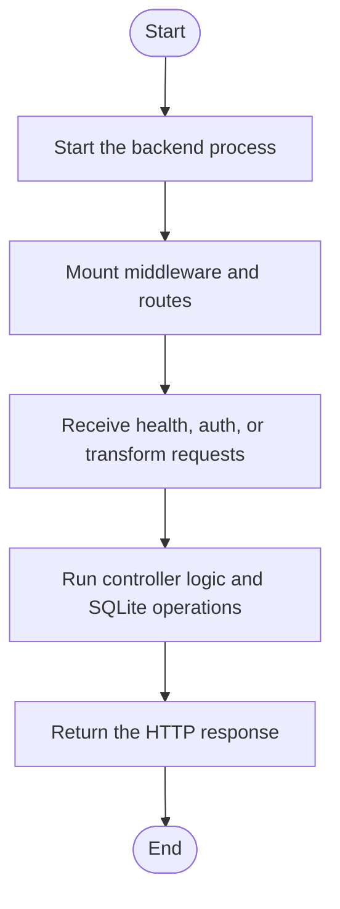

# Thesis Code Transformation Backend

A secure Node.js + Express backend for code transformation workflows, with authentication, file upload, and SQLite storage.

## Setup & Run

1. Install dependencies:
   ```sh
   npm install
   ```
2. Configure environment in `.env` (see sample in repo).
3. Start in dev mode:
   ```sh
   npm run dev
   ```
   Or production:
   ```sh
   npm start
   ```

## API Endpoints

### Health
- `GET /health` → `{ "status": "Backend running" }`

### Auth
- `POST /auth/register` — `{ username, email, password }`
- `POST /auth/login` — `{ email, password }` → `{ token }`

### Transformation
- `POST /api/transform` (JWT required)
  - Upload: single file (`.cpp`, `.cc`, `.cxx`, `.rs`), max 2MB
  - Returns job info and output placeholder

## Directory Structure
- `src/` — main code
- `routes/`, `controllers/`, `middleware/`, `services/`, `db/`, `utils/`
- `uploads/` — uploaded files
- `outputs/` — transformation outputs

## Quick Test Commands

Register:
```
curl -X POST http://localhost:3001/auth/register -H "Content-Type: application/json" -d '{"username":"testuser","email":"test@example.com","password":"testpass"}'
```

Login:
```
curl -X POST http://localhost:3001/auth/login -H "Content-Type: application/json" -d '{"email":"test@example.com","password":"testpass"}'
```

Health:
```
curl http://localhost:3001/health
```

Protected upload (replace TOKEN and FILE):
```
curl -X POST http://localhost:3001/api/transform -H "Authorization: Bearer TOKEN" -F "file=@/path/to/source.cpp"
```

<!-- AUTO-IMPLEMENTATION-STORY-START -->

## Implementation Story
This README explains the implemented backend as a running request pipeline. The code it describes starts in Backend/server.js, moves through Express middleware and route bindings, reaches controllers such as authController.js and transformController.js, and persists state through the SQLite setup created by initDb.js.

## Activity Diagram


<!-- AUTO-IMPLEMENTATION-STORY-END -->

