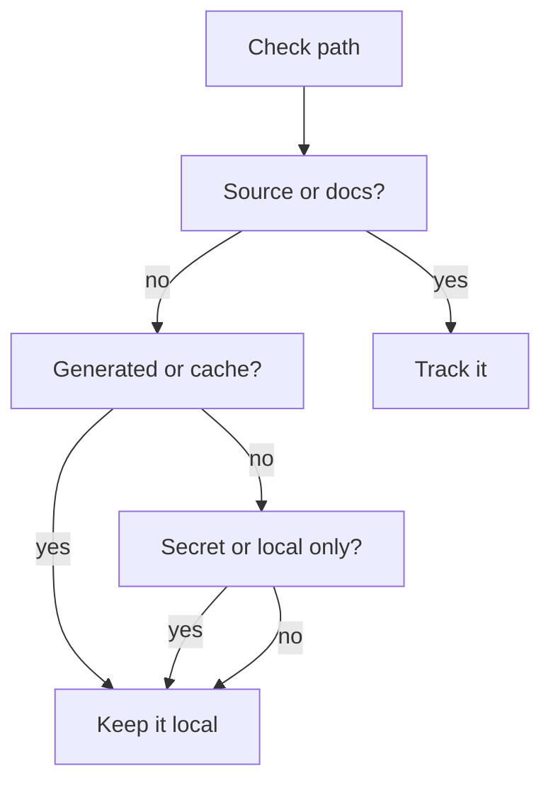

# .gitignore

- Source: repository Git hygiene policy
- Kind: tracked-vs-local artifact guidance
- Updated on: 2026-06-10

## Policy

This policy keeps the repository focused on intentional source, docs, manifests, lockfiles, and deliberate fixtures. Everything that is local, generated, sensitive, or machine-specific should stay out of Git unless a blueprint file explicitly says the artifact is intentionally tracked.

Tracked by default:
- source files
- blueprint docs under `docs/Codebase`
- package manifests and lockfiles
- build scripts and configuration
- deliberate test fixtures and sample inputs
- intentionally tracked runtime contracts

Ignored by default:
- dependency caches and installed packages
- build output and generated bundles
- compiler and test artifacts
- runtime logs and crash dumps
- editor state, OS metadata, and temporary files
- local scratch workspaces and export files
- secrets, tokens, certificates, and other sensitive local files

## Why It Exists

The backend and frontend dependencies should come from manifests rather than committed caches. The C++ microservice build directories should be recreated from the checked-in build configuration. Local notes, scratch data, and secrets should remain machine-specific unless a reviewer has agreed that they belong in the repository.

## Reading Order

Read this note after the root blueprint when you need to decide whether a path should be tracked, ignored, or kept local. It is a policy document, not a cleanup log.

## Practical Notes

- If a local file contains credentials, do not stage it just because it is useful for reproduction.
- If a build artifact is tracked accidentally, remove it from Git and keep the rule that blocks it from returning.
- If a generated artifact is intentionally tracked, document why in the blueprint instead of treating it as normal source.
- If a scratch file matters long term, promote it to a real source, test, or docs path rather than leaving it in a temporary location.

## Acceptance Checks

- `git status --short` stays focused on intentional source, docs, and deliberate fixture changes.
- `git check-ignore -v` confirms the expected cache, build, log, and scratch paths are ignored.
- Local secrets and machine-specific files are not added by habit.
- Tracked generated artifacts are rare, documented exceptions.
