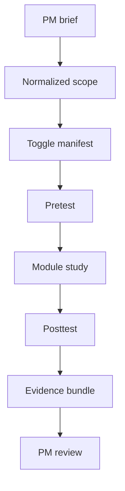

# Gemini Implementation Handoff

- Scope: `Backend/src` project-learning orchestration
- Purpose: code-ready blueprint for Gemini to implement the new project-manager -> system -> intern -> review flow

## Read First

1. `docs/Codebase/Backend/ProjectLearningOrchestration/README.md`
2. `docs/Codebase/Backend/src/routes/projectLearningOrchestration.js.md`
3. `docs/Codebase/Backend/src/controllers/projectLearningOrchestrationController.js.md`
4. `docs/Codebase/Backend/src/services/projectLearningContracts.js.md`
5. `docs/Codebase/Backend/src/services/projectSpecIntakeService.js.md`
6. `docs/Codebase/Backend/src/services/featureTogglePolicyService.js.md`
7. `docs/Codebase/Backend/src/services/assessmentOrchestrationService.js.md`
8. `docs/Codebase/Backend/src/services/readinessEvidenceService.js.md`

## Goal

Implement a backend workflow where:

1. The project manager submits a project brief and architecture/business constraints.
2. The system converts that brief into a narrow learning scope with implicit deny.
3. The intern receives only the required pretest, modules, and posttests for that scope.
4. Passing a pretest bypasses matching modules.
5. Passing a posttest ends the module; failing it repeats the module.
6. The project manager reviews a ready suggestion plus all evidence needed for manual verification.

## Proposed Code Files

Create these files under `Backend/src`:

- `routes/projectLearningOrchestration.js`
- `controllers/projectLearningOrchestrationController.js`
- `services/projectLearningContracts.js`
- `services/projectSpecIntakeService.js`
- `services/featureTogglePolicyService.js`
- `services/assessmentOrchestrationService.js`
- `services/readinessEvidenceService.js`

If the project needs persistence, add the smallest possible storage helpers in the existing `db` area instead of building a new subsystem.

## Architecture Boundary

### Route Layer

Responsibilities:
- define endpoints
- apply auth/role middleware
- dispatch to controller methods

Do not:
- parse business specs
- score assessments
- compute toggle policy
- assemble evidence bundles

### Controller Layer

Responsibilities:
- validate request payloads
- call the correct service
- normalize HTTP responses
- return diagnostics when input is invalid

Do not:
- infer scope manually
- decide pass/fail thresholds inline
- build toggle manifests directly

### Service Layer

Responsibilities:
- convert project briefs into structured scope
- convert scope into implicit-deny toggles
- run pretest/posttest orchestration
- package readiness evidence for PM review

## Endpoint Contract

### `POST /api/project-learning/projects/:projectId/spec`

Purpose:
- intake project manager brief

Request body:

```json
{
  "projectId": "proj-1024",
  "projectTitle": "Retail billing redesign",
  "businessSpecs": ["support rule-based billing"],
  "architectureSpecs": ["favor structural patterns where they reduce coupling"],
  "businessProcess": "..."
}
```

Response:

```json
{
  "projectId": "proj-1024",
  "scopeVersion": "scope-7",
  "requiredPatterns": ["adapter", "facade"],
  "requiredTopics": ["module boundaries", "dependency direction"],
  "excludedPatterns": ["builder"],
  "status": "ready-for-toggle-resolution"
}
```

### `POST /api/project-learning/projects/:projectId/scope`

Purpose:
- convert AI-derived scope into a toggle manifest

Request body:

```json
{
  "projectId": "proj-1024",
  "scopeVersion": "scope-7",
  "requiredPatterns": ["adapter", "facade"],
  "requiredTopics": ["module-boundaries", "dependency-direction"],
  "excludedPatterns": ["builder"]
}
```

Response:

```json
{
  "projectId": "proj-1024",
  "scopeVersion": "scope-7",
  "implicitDeny": true,
  "toggles": [
    { "key": "pattern.adapter", "enabled": true },
    { "key": "pattern.builder", "enabled": false }
  ],
  "status": "applied"
}
```

### `POST /api/project-learning/projects/:projectId/interns/:internId/pretest`

Purpose:
- score scoped pretest

Request body:

```json
{
  "projectId": "proj-1024",
  "internId": "int-44",
  "moduleId": "adapter",
  "attemptType": "pretest",
  "answers": [
    { "questionId": "q1", "answer": "..." }
  ]
}
```

Response:

```json
{
  "projectId": "proj-1024",
  "internId": "int-44",
  "moduleId": "adapter",
  "attemptType": "pretest",
  "decision": "pass",
  "nextAction": "bypass-module",
  "score": 92,
  "waivedSections": ["adapter-introduction", "adapter-usage"]
}
```

### `POST /api/project-learning/projects/:projectId/modules/:moduleId/posttest`

Purpose:
- score posttest after module completion

Request body:

```json
{
  "projectId": "proj-1024",
  "internId": "int-44",
  "moduleId": "adapter",
  "attemptType": "posttest",
  "answers": [
    { "questionId": "q9", "answer": "..." }
  ]
}
```

Response:

```json
{
  "projectId": "proj-1024",
  "internId": "int-44",
  "moduleId": "adapter",
  "attemptType": "posttest",
  "decision": "pass",
  "nextAction": "module-complete",
  "score": 88
}
```

### `GET /api/project-learning/projects/:projectId/readiness`

Purpose:
- return ready candidates and evidence

Response:

```json
{
  "projectId": "proj-1024",
  "readyInterns": [
    {
      "internId": "int-44",
      "status": "ready",
      "evidenceRef": "ev-9012",
      "summary": {
        "pretest": "pass",
        "posttest": "pass"
      }
    }
  ]
}
```

## Function Plan

### `projectLearningContracts.js`

Export shared shapes only.

Suggested exports:
- `createProjectBriefInput`
- `createProjectLearningScope`
- `createToggleManifest`
- `createAssessmentRecord`
- `createReadinessEvidenceBundle`

Keep them as plain objects or schema helpers, depending on the code style already used in the repo.

### `projectSpecIntakeService.js`

Suggested functions:
- `intakeProjectBrief(input)`
- `extractRequiredPatterns(brief)`
- `extractRequiredTopics(brief)`
- `extractExcludedPatterns(brief)`
- `normalizeProjectLearningScope(parsedInput)`

Rules:
- infer the narrowest useful scope from the brief
- preserve uncertainty if the brief is vague
- never broaden into the full catalog

### `featureTogglePolicyService.js`

Suggested functions:
- `buildImplicitDenyManifest(scope)`
- `enableRequiredPatterns(manifest, scope)`
- `disableExcludedPatterns(manifest, scope)`
- `resolveTogglePolicy(scope)`

Rules:
- default all toggles to off
- enable only what the scope requires
- keep excluded patterns off even if they appear elsewhere

### `assessmentOrchestrationService.js`

Suggested functions:
- `scorePretestAttempt(input)`
- `shouldBypassModule(pretestResult)`
- `scorePosttestAttempt(input)`
- `decideNextAction(posttestResult)`
- `buildAssessmentOutcome(input, score, decision)`

Rules:
- pretest pass means bypass the module sections
- posttest pass means complete the module
- posttest fail means repeat the module

### `readinessEvidenceService.js`

Suggested functions:
- `collectCodeRuns(...)`
- `collectTheoreticalAnswers(...)`
- `collectExamResults(...)`
- `collectRawResultData(...)`
- `buildReadinessEvidenceBundle(...)`
- `listReadyInterns(projectId)`

Rules:
- keep summary and raw evidence together
- never hide answer data from the PM review surface
- preserve traceability to the exact intern and project

### `projectLearningOrchestrationController.js`

Suggested methods:
- `createProjectScope(req, res)`
- `resolveProjectScopeToggles(req, res)`
- `submitInternPretest(req, res)`
- `submitInternPosttest(req, res)`
- `getProjectReadiness(req, res)`

Rules:
- map request body to the right service call
- return HTTP diagnostics for invalid input
- do not decide policy inline

## Recommended Implementation Order

1. Create `projectLearningContracts.js`.
2. Create `projectSpecIntakeService.js`.
3. Create `featureTogglePolicyService.js`.
4. Create `assessmentOrchestrationService.js`.
5. Create `readinessEvidenceService.js`.
6. Create `projectLearningOrchestrationController.js`.
7. Create `projectLearningOrchestration.js` routes.
8. Wire the route into the existing backend router.
9. Add persistence only if the runtime needs durable readiness state.

## Minimal Internal Flow



## Suggested Error Handling

- invalid brief payload -> `400`
- unsupported project or intern id -> `404`
- malformed answer set -> `422`
- unexpected service failure -> `500`

Keep errors structured and backend-safe. Do not leak raw internal stack traces to the PM or intern UI.

## Acceptance Checks For Gemini

- The route file stays thin and only wires handlers.
- The controller delegates to services and does not contain policy logic.
- The scope service returns a narrow project-specific scope.
- The toggle service defaults everything to implicit deny.
- The assessment service supports bypass, repeat, and complete outcomes.
- The evidence service returns both summary status and raw evidence.
- The PM review endpoint exposes code runs, answers, results, and raw data.
- All files compile or parse consistently with the repository's existing backend style.
