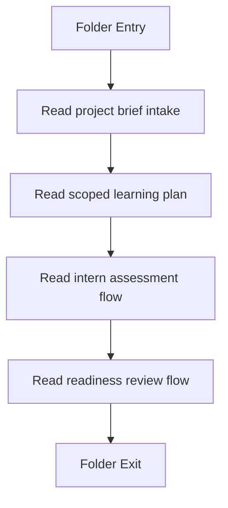
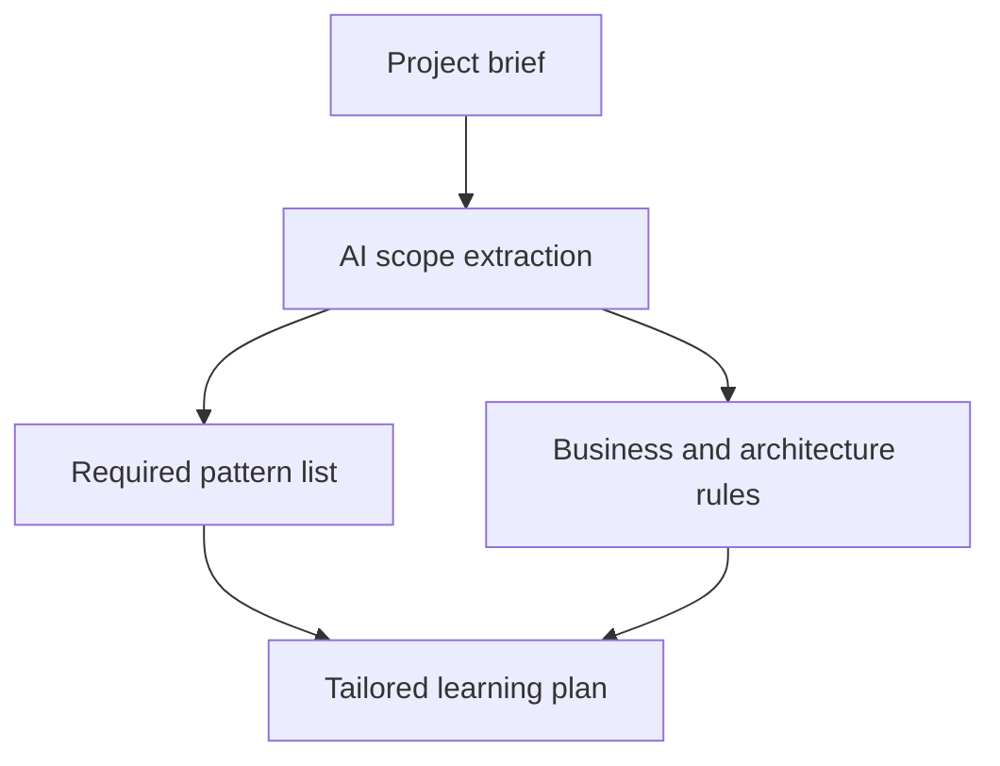
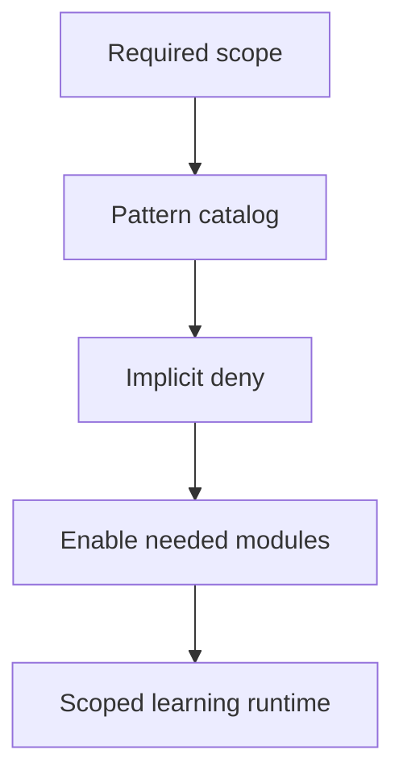
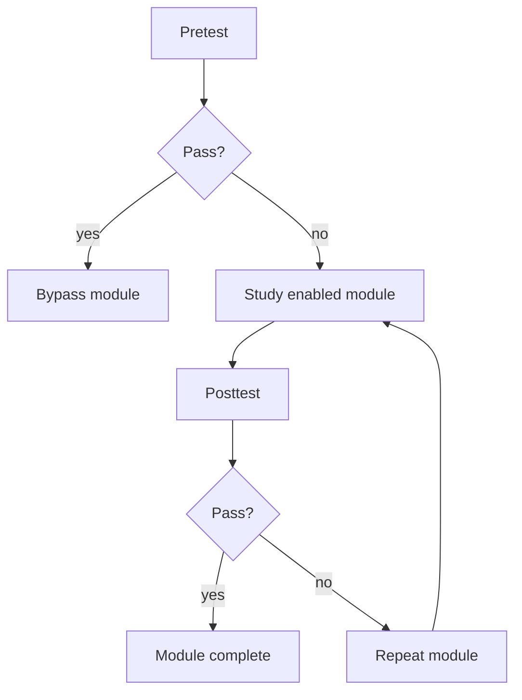
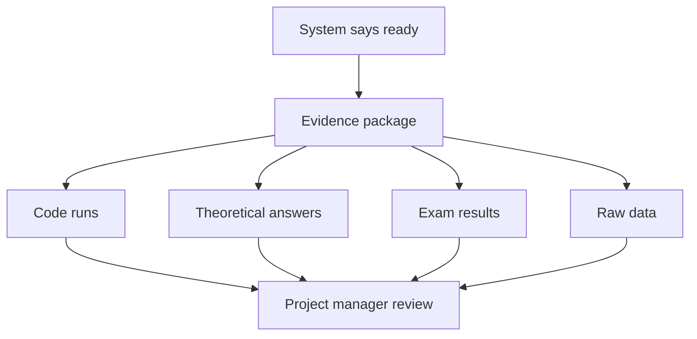

# ProjectLearningOrchestration

- Folder: docs/Codebase/Backend/ProjectLearningOrchestration
- Intended descendant source docs: future backend services, routes, and dashboard contracts

## Logic Summary
Tailored project-to-learning orchestration for the PM, system, intern, and review loop. A project manager describes business specifications and architectural constraints, the system turns that into a narrow pattern-learning scope with implicit deny, interns complete only the required pretest, module study, and posttest steps, and the project manager receives reviewable evidence instead of a black-box decision.

## Subsystem Story
This folder owns the orchestration boundary for project-specific learning plans and readiness review. It is the place to describe how a project brief becomes a scoped study plan, how learning gates are toggled on and off, how assessment bypass works, and how the final readiness evidence returns to the project manager.

Do not place generic runtime infrastructure or unrelated CRUD here. Those belong under the normal backend service surface or other existing subsystem folders.

## Planned Code Shape
This document is the blueprint for the future backend implementation. The implementation-facing docs now live under `docs/Codebase/Backend/src/` so the actual code handoff stays aligned with the backend source tree.

Use this folder as the high-level map, then read the route, controller, and service docs under `Backend/src`.

- Route doc: `docs/Codebase/Backend/src/routes/projectLearningOrchestration.js.md`
- Controller doc: `docs/Codebase/Backend/src/controllers/projectLearningOrchestrationController.js.md`
- Service docs: `docs/Codebase/Backend/src/services/*.js.md`
- Gemini handoff: `docs/Codebase/Backend/ProjectLearningOrchestration/GEMINI_IMPLEMENTATION_HANDOFF.md`

The route layer should stay thin. Controllers should translate HTTP requests into orchestration commands. Services should own the project brief parsing, scope narrowing, assessment flow, and evidence packaging.

## Folder Flow

## End-to-End Orchestration
### Step 1 - Project Manager Intake
The project manager gives the AI a project brief, architecture constraints, and business-process notes. The AI returns the exact structural design patterns and supporting topics that matter for this project only.

Quick summary: convert a broad business prompt into a narrow learning scope.

Why this is separate: the intake stage decides what is in scope before any user learning or test logic starts.

Implementation note:
- The AI output should be normalized into a structured contract before it reaches the rest of the system.
- The contract should carry required patterns, excluded patterns, required competencies, and any project-specific exceptions.

### Step 2 - System Feature Toggle Policy
The system converts the AI response into model-backed publish toggles with implicit deny. The AI response is section-first: each module category is treated as a section, only sections that should be ON appear in the JSON, and any section that is missing is treated as OFF. Only the structural design patterns and modules needed for the project are turned on. The actual toggle targets live in the module catalog and learning models, not in the general config surface. Config is reserved for adding structural pattern families outside the GoF catalog.

Quick summary: keep the default state off and open only the required learning paths.

Why this is separate: this stage is a policy gate, not a teaching or testing stage.

Implementation note:
- Every module and pattern family should default to off.
- Only the AI-approved subset should be enabled for the current project and user.
- Anything outside the project scope should remain invisible or inaccessible in the learning runtime.

### Step 3 - Intern Pretest, Study, and Posttest
The intern starts with a pretest aligned only to the required scope. Passing the pretest bypasses the matching learning modules or sections. If the pretest fails, the intern studies the enabled modules. After each module, a posttest checks whether the material was understood. The theoretical and practical question banks are pre-authored in the module models, and each question is already tagged before the learner ever sees it.

Quick summary: remove already-known material, then verify learning with posttests.

Why this is separate: the intern flow has its own loop and pass/fail decisions, so it needs its own local path.

Implementation note:
- Pretest coverage should match the exact project scope, not the full training catalog.
- Passing the pretest should mark the corresponding module sections as waived for that user on that project.
- Posttest results should control readiness for the next module or the final readiness signal.

### Step 4 - Project Manager Readiness Review
Once the system marks a user ready, the project manager sees a suggestion package, not an opaque verdict. The review surface should expose the code runs, theoretical exam answers, exam scores, and raw result data so the manager can audit the decision.
The review surface should also retain a local window of recent runs and offer spreadsheet exports when the operator wants to inspect responses, logs, or raw time/space measurements outside the UI.

Quick summary: surface evidence, not just a green status.

Why this is separate: the final surface is a review workflow, not a learning workflow.

Implementation note:
- The PM should be able to inspect both the summary decision and the supporting evidence.
- The suggestion tool must not hide raw scores, answer keys, or trace data needed for manual review.

## Acceptance Checks
- A project brief can be transformed into a structured learning scope without exposing the full catalog.
- The system defaults to implicit deny and enables only the required pattern sections/modules for the project.
- Course publish state is resolved from the model catalog, not from generic config, unless the team is extending beyond the GoF pattern set.
- The module catalog already carries tagged theoretical and practical questions, so runtime only selects from prepared content.
- A passing pretest bypasses the matching module sections for that user on that project.
- A failing pretest routes the user into the enabled study modules.
- A module posttest can end the module or send the user back through the module again.
- The project manager can review readiness with code runs, answers, scores, and raw evidence data.
- The PM view remains a suggestion layer and does not suppress the underlying evidence.
- The review system can keep the latest 150 runs locally for fast inspection and export them to spreadsheet format.

## Boundary Notes
- Keep the orchestration contract separate from the raw assessment payloads.
- Keep feature toggle policy separate from the learning content itself.
- Keep config separate from the module catalog unless the request is to add non-GoF structural pattern families.
- Keep final review evidence separate from the readiness decision so manual auditing stays possible.

## Reading Order
1. Read the project brief intake contract first.
2. Read the feature toggle policy next.
3. Read the assessment flow after that.
4. Read the evidence review contract last.
