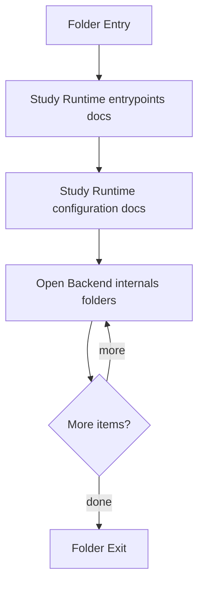

# Backend

- Folder: docs/Codebase/Backend
- Descendant source docs: 14
- Generated on: 2026-04-23

## Logic Summary
Backend service surface. This area groups the Express entrypoint, package metadata, and the HTTP runtime internals under src.

## Subsystem Story
This folder mixes concrete local documents with deeper child subsystems. Read the local docs to understand the visible behavior first, then descend into the child folders for the lower-level detail that supports it.

## Folder Flow

## Child Folders By Logic
### Backend Internals
These child folders continue the subsystem by covering Backend internals grouped by request flow. Routing directs requests into middleware, then controllers, with database, service, and utility helpers supporting the work..
- src/ : Backend internals grouped by request flow. Routing directs requests into middleware, then controllers, with database, service, and utility helpers supporting the work.

## Documents By Logic
### Runtime Entrypoints
These documents explain the local implementation by covering Bootstraps the Express backend, middleware stack, routes, database initialization, and filesystem layout..
- server.js.md : Bootstraps the Express backend, middleware stack, routes, database initialization, and filesystem layout.

### Runtime Configuration
These documents explain the local implementation by covering Declares backend scripts and runtime dependencies..
- package.json.md : Declares backend scripts and runtime dependencies.

## Reading Hint
- Read the local file docs first for concrete behavior, then descend into the child folders for narrower subsystem details.

