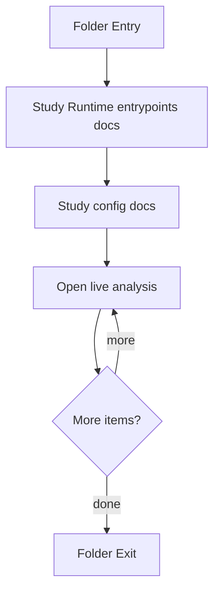

# Backend

- Folder: docs/Codebase/Backend
- Descendant source docs: 16
- Generated on: 2026-04-23

## Logic Summary
Backend service surface. This area groups the Express entrypoint, package metadata, and the HTTP runtime internals under src. The current blueprint centers on live class analysis: frontend sends only completed class declarations, backend runs analysis services, then backend prepares AI documentation and structured logs.

## Subsystem Story
This folder mixes concrete local documents with deeper child subsystems. Read the local docs to understand the visible behavior first, then descend into the child folders for the lower-level detail that supports it.

## Folder Flow

## Child Folders By Logic
### Backend Internals
These child folders continue the subsystem by covering Backend internals grouped by request flow. Routing directs requests into middleware, then controllers, with database, service, and utility helpers supporting live class analysis, AI documentation, and structured logs.
- src/ : Backend internals grouped by request flow for live class analysis and support services.

### Project Learning Orchestration
These child folders continue the subsystem by covering the tailored project-to-learning loop. The boundary turns project specs into a scoped pattern plan, applies implicit-deny feature toggles, runs aligned pretests and posttests, and returns readiness evidence to the project manager.
- ProjectLearningOrchestration/ : Tailored project-to-learning orchestration for scoped study, assessment bypass, and evidence review.

## Documents By Logic
### Runtime Entrypoints
These documents explain the local implementation by covering Bootstraps the Express backend, middleware stack, routes, database initialization, and filesystem layout.
- server.js.md : Bootstraps the Express backend, middleware stack, routes, database initialization, and filesystem layout.

### Runtime Configuration
These documents explain the local implementation by covering Declares backend scripts and runtime dependencies.
- package.json.md : Declares backend scripts and runtime dependencies.

## Reading Hint
- Read `src/routes/transform.js.md`, then `src/controllers/transformController.js.md`, then `src/services/classDeclarationAnalysisService.js.md` and `src/services/aiDocumentationService.ts.md`.
- For the tailored project-to-learning loop, start with `ProjectLearningOrchestration/README.md`.

