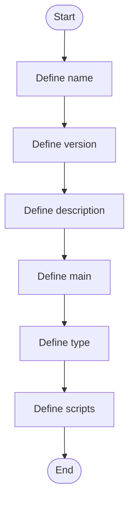

# package.json

- Source: Backend/package.json
- Kind: JSON configuration
- Lines: 26
- Role: Declares backend scripts and runtime dependencies.
- Chronology: This artifact participates in the repository flow according to the surrounding module or toolchain that loads it.

## Notable Symbols
- name
- version
- description
- main
- type
- scripts
- dev
- start
- dependencies
- bcrypt
- better-sqlite3
- cors

## Direct Dependencies
- No direct dependency list was extracted from the file text.

## Implementation Story
This manifest tells the backend runtime how to start and what to load. Its implementation role is declarative: it defines the executable scripts and package dependencies that make the Express service run. Declares backend scripts and runtime dependencies. This artifact participates in the repository flow according to the surrounding module or toolchain that loads it. The implementation surface is easiest to recognize through symbols such as name, version, description, and main.

## Activity Diagram

## Documentation Note
- This markdown file is part of the generated docs/Codebase mirror.
- It was generated from the repository state on 2026-04-22 after reading the existing docs corpus and the current source tree.

