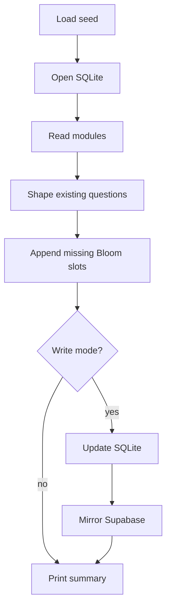

# `repairLearningQuestionBank.mjs`

## Sole job

Repair persisted `learning_modules.theoretical_json` rows that do not yet match the canonical mixed question bank. The script compares each database row against `src/db/seeds/learningModules.seed.json`, normalizes legacy MCQ questions, drops invalid question objects, and appends any missing Bloom taxonomy slots from the seed.

## Run Mode

- Default mode is dry-run and prints the modules that would change.
- `--write` updates SQLite and bumps `course_updated_at`.
- `--db=...` points the repair at a specific SQLite file.
- When `SUPABASE_URL` and `SUPABASE_SERVICE_KEY` are configured, write mode mirrors changed rows to Supabase.

## Repair Flow

## Safety Boundary

The script repairs structure, not authoring intent. It preserves valid existing questions and only uses seed questions to fill missing Bloom slots. It must not be run through the forbidden rebuild scripts; run it directly through the backend npm script.

## Acceptance Checks

- Dry-run reports changed modules without mutating the database.
- Write mode updates only modules with structural question-bank drift.
- `course_updated_at` changes after a write so stale learner gates are invalidated.
- Supabase mirroring is skipped unless service credentials are present.
