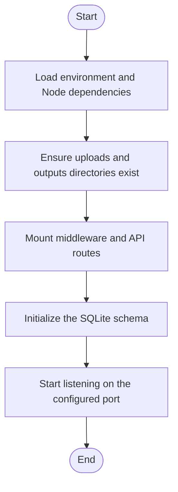

# server.js

- Source: Backend/server.js
- Kind: JavaScript module
- Lines: 48
- Role: Bootstraps the Express backend, middleware stack, routes, database initialization, and filesystem layout.
- Chronology: Backend process entrypoint: it starts before any API request can reach auth or transform handlers.

## Notable Symbols
- express
- helmet
- cors
- morgan
- path
- fs
- healthRoutes
- authRoutes
- transformRoutes
- app
- PORT

## Direct Dependencies
- dotenv
- express
- helmet
- cors
- morgan
- path
- fs
- ./src/middleware/errorHandler
- ./src/db/initDb
- ./src/routes/health
- ./src/routes/auth
- ./src/routes/transform

## File Outline
### Responsibility

This file is the backend runtime bootstrapper. Its implementation loads environment configuration, creates the working directories used for uploads and outputs, mounts the security and routing middleware stack, initializes the SQLite schema, and finally opens the HTTP listener.

### Position In The Flow

Backend process entrypoint: it starts before any API request can reach auth or transform handlers.

### Main Surface Area

Bootstraps the Express backend, middleware stack, routes, database initialization, and filesystem layout. The main surface area is easiest to track through symbols such as express, helmet, cors, and morgan. It collaborates directly with dotenv, express, helmet, and cors.

## File Activity

## Documentation Note
- This markdown file is part of the generated docs/Codebase mirror.
- It was generated from the repository state on 2026-04-23 after reading the existing docs corpus and the current source tree.

