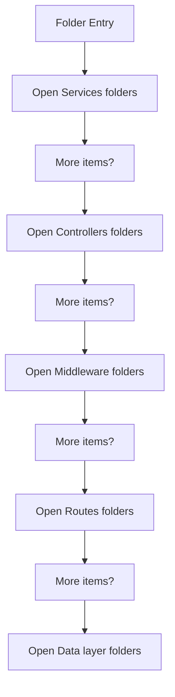
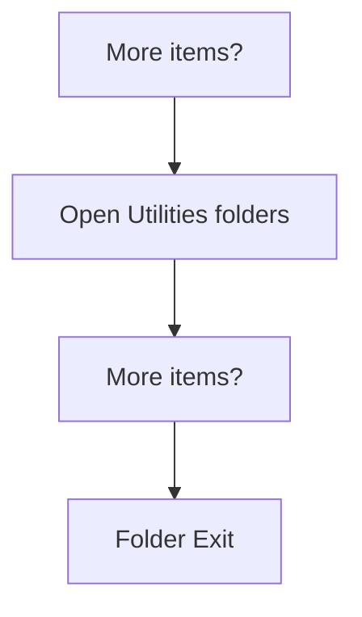

# src

- Folder: docs/Codebase/Backend/src
- Descendant source docs: 12
- Generated on: 2026-04-23

## Logic Summary
Backend internals grouped by request flow. Routing directs requests into middleware, then controllers, with database, service, and utility helpers supporting the work.

## Subsystem Story
This folder mainly acts as a navigation layer. Use it to understand how the deeper child folders divide the subsystem into smaller concerns.

## Folder Flow

### Block 1 - Folder Flow Details
#### Part 1

#### Part 2

## Child Folders By Logic
### Services
These child folders continue the subsystem by covering Reusable backend support services called from controllers or middleware..
- services/ : Reusable backend support services called from controllers or middleware.

### Controllers
These child folders continue the subsystem by covering Controller layer for concrete backend request handling after routing and middleware have finished preliminary work..
- controllers/ : Controller layer for concrete backend request handling after routing and middleware have finished preliminary work.

### Middleware
These child folders continue the subsystem by covering Cross-cutting backend request logic such as auth, upload handling, and error shaping..
- middleware/ : Cross-cutting backend request logic such as auth, upload handling, and error shaping.

### Routes
These child folders continue the subsystem by covering Route layer that maps URL paths to middleware chains and controller entrypoints..
- routes/ : Route layer that maps URL paths to middleware chains and controller entrypoints.

### Data Layer
These child folders continue the subsystem by covering SQLite-oriented persistence helpers and schema initialization logic..
- db/ : SQLite-oriented persistence helpers and schema initialization logic.

### Utilities
These child folders continue the subsystem by covering Small backend utilities used to keep the request handlers concise..
- utils/ : Small backend utilities used to keep the request handlers concise.

## Reading Hint
- Use the child folder groups to navigate deeper into this subsystem.
