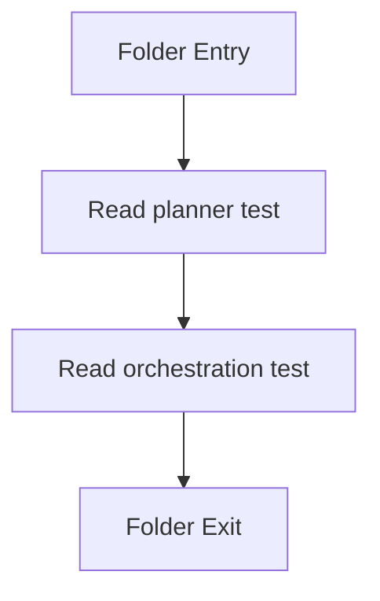

# __tests__

- Folder: `docs/Codebase/Backend/src/__tests__`
- Descendant source docs: 2

## Logic Summary
Service-level backend tests that pin the two project-learning surfaces: the admin planner path and the project orchestration path.

## Subsystem Story
Use this folder after the service docs. The tests do not define new behavior; they lock the expected service outputs so the planner and orchestration flows stay predictable.

## Folder Flow

## Documents By Logic
### Tests
These documents explain the two service-level verification surfaces.
- coursePlannerService.test.ts.md : Pins the admin planner API surface with a mocked provider and a diverse heuristic fallback plan.
- projectLearningOrchestration.test.ts.md : Pins the project orchestration API surface across brief intake, implicit-deny toggles, and assessment gating.

## Reading Hint
- Read `coursePlannerService.test.ts.md` first if you want the admin planner surface.
- Read `projectLearningOrchestration.test.ts.md` next for the project orchestration surface.
