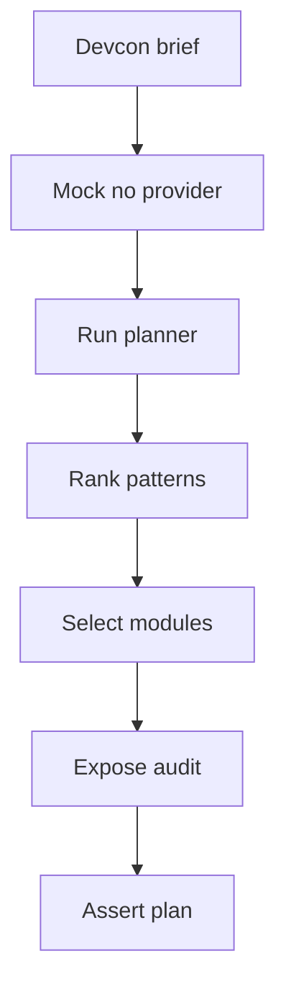

# coursePlannerService.test.ts

- Source: `Backend/src/__tests__/coursePlannerService.test.ts`
- Kind: Vitest service-level test

## Story
### What Happens Here

This test pins the admin planner UI/API surface. It mocks provider selection so the planner stays on the local heuristic path, then feeds in a Devcon-style student delegation brief.

The brief is meant to prove that the planner does not collapse to Adapter alone. The heuristic should surface multiple non-adapter pattern modules when the brief clearly asks for a repository boundary, state-driven actions, and runtime strategy selection. Queued review work and fan-out cues stay in the brief so the planner has enough context to stay diverse.

### Why It Matters In The Flow

The admin course-plan screen depends on predictable planner output. This test makes sure the backend can explain a diverse plan even when the AI provider is unavailable.

## Test Flow

## Acceptance Checks

- The planner stays on the heuristic fallback path when no provider is available.
- The published plan includes multiple non-adapter pattern modules for a Devcon-style student brief.
- The selected patterns include `repository`, `state`, and `strategy`.
- Adapter is not the only selected pattern and should not dominate the plan.
- The pattern audit remains visible so the admin preview can explain the selection.
