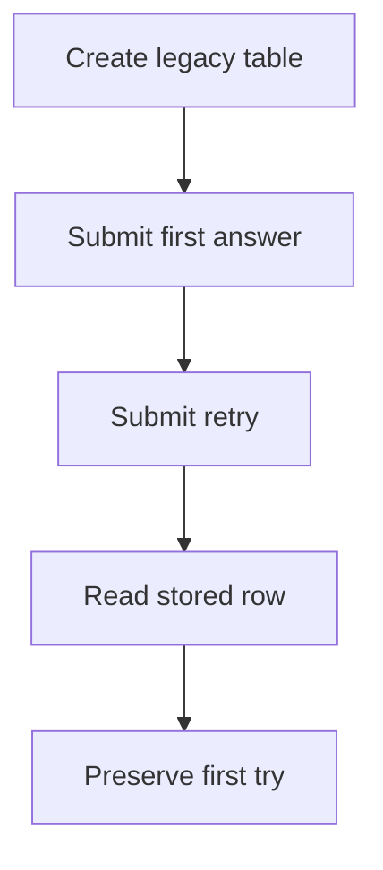

# `learningAnswersLegacySchema.test.ts`

## Sole job

Protect conceptual-assessment persistence on databases created before `session_id` joined the question-result key.

## Acceptance checks

- The route does not raise an `ON CONFLICT` constraint error.
- A retry updates the selected answer and correctness.
- Attempt count increments.
- First-attempt correctness remains unchanged.
