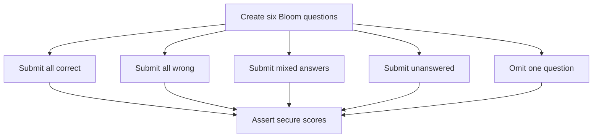

# `learningAssessmentGrader.test.ts`

## Sole job

Pin authoritative Learner Path scoring against an in-memory canonical question bank.

## Coverage

- Perfect answers produce 100%.
- Wrong answers produce 0%.
- Mixed answers cannot produce a perfect score.
- Unanswered items remain in the denominator.
- Incomplete final attempts are rejected.
