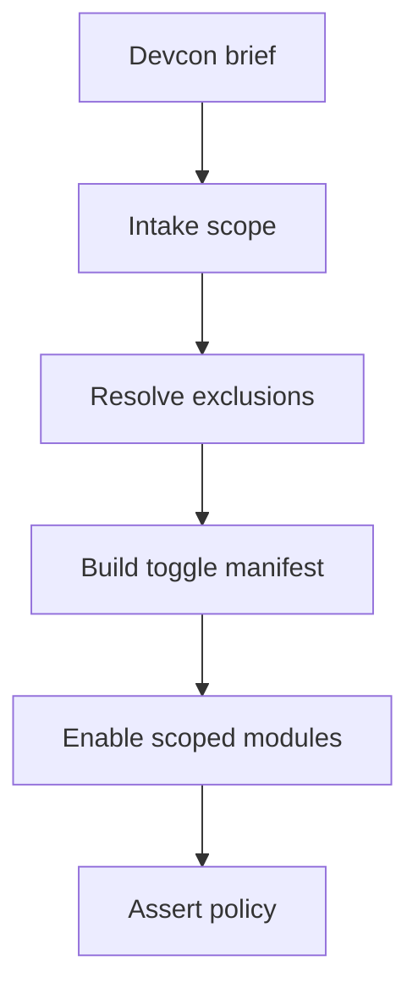
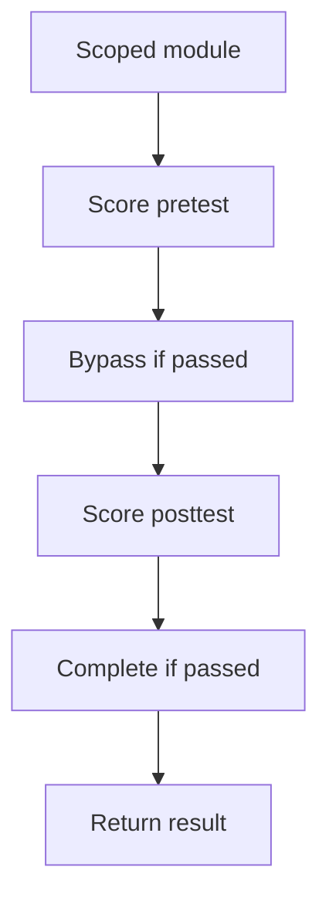

# projectLearningOrchestration.test.ts

- Source: `Backend/src/__tests__/projectLearningOrchestration.test.ts`
- Kind: Vitest service-level test

## Story
### What Happens Here

This test pins the project orchestration API surface. It takes a Devcon-style student delegation brief through project intake, implicit-deny toggle resolution, and the assessment loop.

The scope check verifies that the brief resolves to a diverse pattern set instead of an Adapter-shaped answer. The toggle check then proves that excluded patterns stay disabled while the required learning modules and topics stay enabled for the project.

### Why It Matters In The Flow

The orchestration path is the project manager's contract with the learning backend. It must preserve the scoped module set, keep the excluded patterns off, and still support pretest and posttest gating for the selected module family.

## Test Flow

### Scope And Toggle Resolution

### Assessment Gating

The assessment checks stay separate because they validate the intern-facing module path after scope has already been resolved.

## Acceptance Checks

- The intake service resolves `command`, `observer`, `repository`, `state`, and `strategy` from the Devcon brief.
- The intake service records explicit exclusions such as `adapter` and `singleton` when the brief says not to use them.
- The toggle manifest enables the scoped patterns and keeps excluded patterns disabled.
- The scope keeps module/pattern data visible for readiness planning.
- A passing pretest still bypasses a non-adapter module.
- A passing posttest still completes the same module family.
