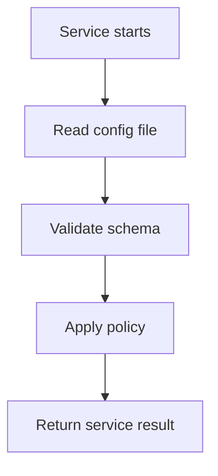

# config

- Folder: `docs/Codebase/Backend/src/config`
- Future source folder: `Codebase/Backend/src/config`

## Logic Summary
Backend-owned runtime configuration that is part of the repository. These files are not admin-editable settings; they define stable policy inputs that services parse and validate before applying request-specific logic.

## Ownership Boundary
This folder may define durable policy data, aliases, and local hints. It must not contain per-user state, secrets, generated analysis data, or database exports.

## Folder Flow

## Documents By Logic
- `projectLearningTogglePolicy.json.md`: repo-owned toggle policy config for project-learning pattern and topic toggles.
