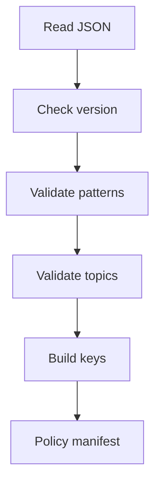

# `projectLearningTogglePolicy.json`

## Sole job

This JSON file defines the project-learning toggle catalog. It lists every supported design-pattern toggle, topic toggle, matching alias, and module hint that the feature-toggle policy service can resolve from a project scope.

## Config Flow

## Policy Contract

- `schemaVersion` pins the loader contract.
- `patterns` must cover every slug in `PATTERN_CATALOG`.
- `toggleKey` values stay in the existing `pattern.*` and `topic.*` manifest shape.
- `aliases` are business-language cues that may appear in scope data.
- `moduleHints` connect a pattern to module ids without hardcoding service arrays.

## Ownership Boundary

This config is repo-owned. It is not an admin runtime setting and should not store project-specific scope decisions. Project scopes still come from intake; this file only says how scopes map to possible toggles.

## Acceptance Checks

- `featureTogglePolicyService.ts` can load and validate the file.
- Every `PATTERN_CATALOG` slug is represented exactly once.
- `template-method` and other non-original pattern toggles are available to the implicit-deny manifest.
