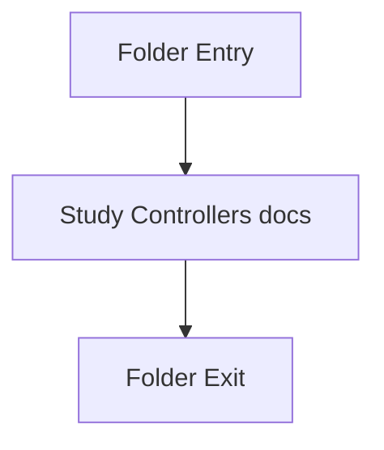

# controllers

- Folder: docs/Codebase/Backend/src/controllers
- Descendant source docs: 2
- Generated on: 2026-04-23

## Logic Summary
Controller layer for concrete backend request handling after routing and middleware have finished preliminary work.

## Subsystem Story
This folder is mostly leaf-level. The local documents here carry the main explanation of the subsystem without requiring much extra descent.

## Folder Flow

## Documents By Logic
### Controllers
These documents explain the local implementation by covering Implements HTTP endpoint behavior after routing and before response serialization..
- authController.js.md : Implements HTTP endpoint behavior after routing and before response serialization.
- transformController.js.md : Implements HTTP endpoint behavior after routing and before response serialization.

## Reading Hint
- This folder is mostly leaf-level. Read the local file docs to understand the logic in this area.

