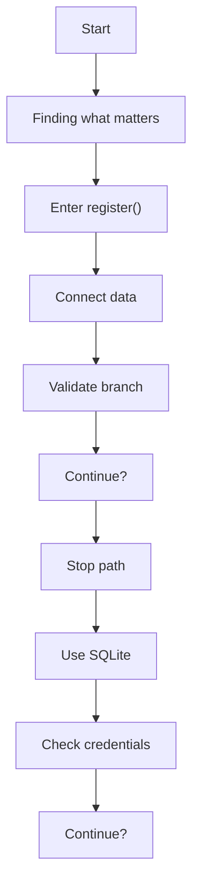
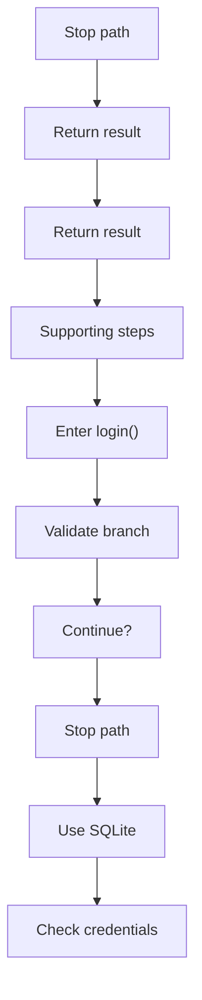
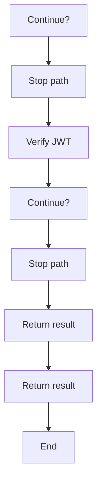
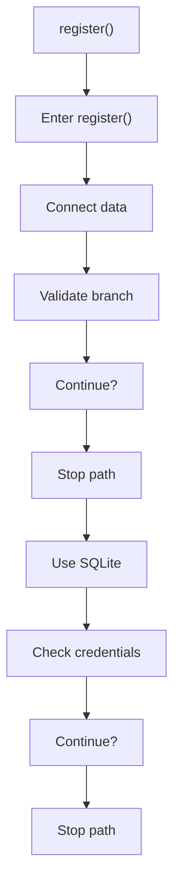
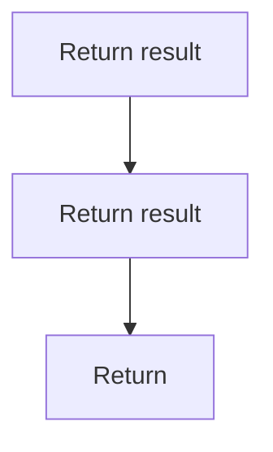
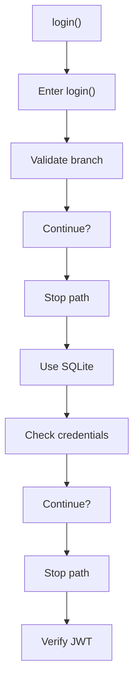
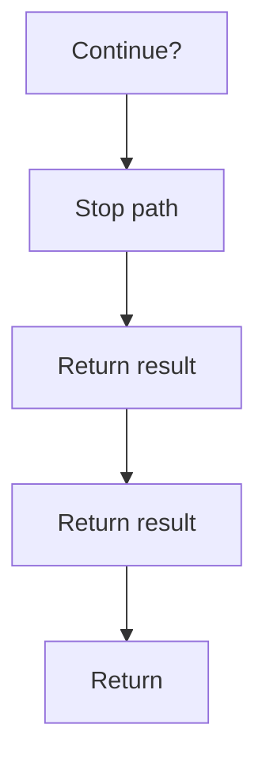

# authController.js

- Source: Backend/src/controllers/authController.js
- Kind: JavaScript module
- Lines: 49

## Story
### What Happens Here

This controller implements the authentication story of the backend. It receives registration or login payloads, validates the required fields, queries the database, hashes or compares credentials, records audit logs, and returns either a JWT or an error response.

### Why It Matters In The Flow

Runs after routing and middleware resolution to perform request-specific backend work.

### What To Watch While Reading

Implements HTTP endpoint behavior after routing and before response serialization. The main surface area is easiest to track through symbols such as bcrypt, jwt, db, and register. It collaborates directly with bcrypt, jsonwebtoken, ../db/database, and ../services/logService.

## Program Flow
This diagram follows the action path in plain words. Decision diamonds show where the file can stop, branch, or repeat work instead of simply passing through a straight line.

### Block 1 - Program Flow Details
#### Part 1

#### Part 2

#### Part 3

## Reading Map
Read this file as: Implements HTTP endpoint behavior after routing and before response serialization.

Where it sits in the run: Runs after routing and middleware resolution to perform request-specific backend work.

Names worth recognizing while reading: bcrypt, jwt, db, register, userExists, and hash.

It leans on nearby contracts or tools such as bcrypt, jsonwebtoken, ../db/database, and ../services/logService.

## Story Groups

### Finding What Matters
These steps pick out the facts, traces, and relationships that later stages need.
- register() (line 5): Connect discovered data back into the shared model, validate conditions and branch on failures, and query or update SQLite state

### Supporting Steps
These steps support the local behavior of the file.
- login() (line 25): Validate conditions and branch on failures, query or update SQLite state, and hash or compare credentials

## Function Stories

### register()
This routine connects discovered items back into the broader model owned by the file. It appears near line 5.

Inside the body, it mainly handles connect discovered data back into the shared model, validate conditions and branch on failures, query or update SQLite state, and hash or compare credentials.

It branches on runtime conditions instead of following one fixed path. The caller receives a computed result or status from this step.

What it does:
- connect discovered data back into the shared model
- validate conditions and branch on failures
- query or update SQLite state
- hash or compare credentials
- return the HTTP response

Flow:

### Block 2 - register() Details
#### Part 1

#### Part 2

### login()
This routine owns one focused piece of the file's behavior. It appears near line 25.

Inside the body, it mainly handles validate conditions and branch on failures, query or update SQLite state, hash or compare credentials, and sign or verify JWT tokens.

It branches on runtime conditions instead of following one fixed path. The caller receives a computed result or status from this step.

What it does:
- validate conditions and branch on failures
- query or update SQLite state
- hash or compare credentials
- sign or verify JWT tokens
- return the HTTP response

Flow:

### Block 3 - login() Details
#### Part 1

#### Part 2

## Documentation Note
- This markdown file is part of the generated docs/Codebase mirror.
- It was generated from the repository state on 2026-04-23 after reading the existing docs corpus and the current source tree.
