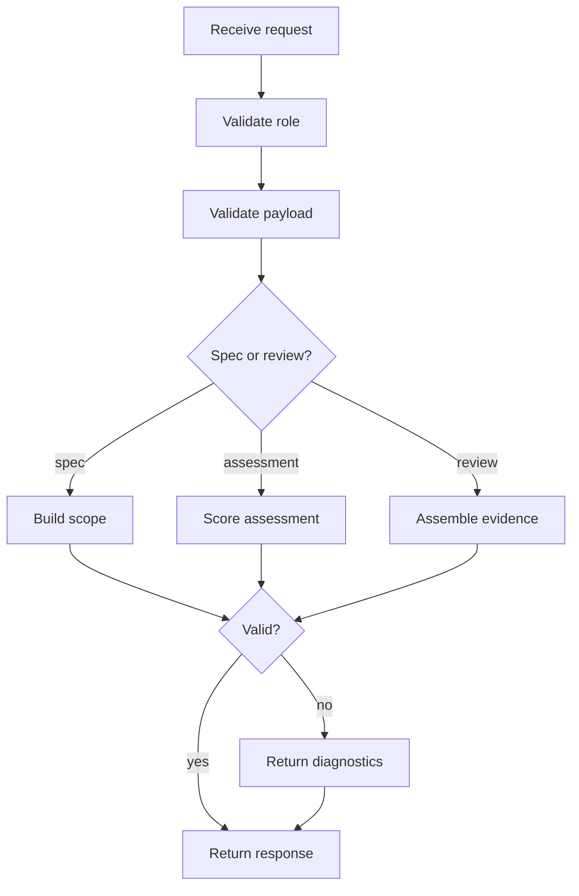

# projectLearningOrchestrationController.js

- Source: `Backend/src/controllers/projectLearningOrchestrationController.js`
- Kind: JavaScript controller module

## Story
### What Happens Here

This controller owns HTTP request handling for the project-learning boundary. It receives project specs, assessment submissions, and readiness review requests, validates them, delegates the actual work to services, and returns a normalized response.

The controller should not infer the learning plan by itself. It should pass the request into the spec-intake service, toggle-policy service, assessment service, and evidence service.

### Why It Matters In The Flow

This is the handoff point between the public backend surface and the orchestration services. It must keep the user-facing API stable while the internal learning policy changes as projects change.

### What To Watch While Reading

Do not mix roles:
- project manager requests define scope and review evidence.
- intern requests define assessment answers and progress.
- services define the actual learning decisions.

## Controller Flow



## Request Contracts

### Project Spec Intake

```json
{
  "projectId": "proj-1024",
  "projectTitle": "Retail billing redesign",
  "businessSpecs": [
    "support rule-based billing",
    "keep workflow auditable"
  ],
  "architectureSpecs": [
    "favor structural patterns where they reduce coupling",
    "keep UI and policy separated"
  ],
  "businessProcess": "Project manager describes the business and the AI returns only the required structural topics."
}
```

### Intern Pretest

```json
{
  "projectId": "proj-1024",
  "internId": "int-44",
  "moduleId": "adapter",
  "answers": [
    { "questionId": "q1", "answer": "..." }
  ]
}
```

### Intern Posttest

```json
{
  "projectId": "proj-1024",
  "internId": "int-44",
  "moduleId": "adapter",
  "answers": [
    { "questionId": "q9", "answer": "..." }
  ]
}
```

### Readiness Review

```json
{
  "projectId": "proj-1024",
  "reviewScope": "all-ready-interns"
}
```

## Response Contracts

### Scope Response

```json
{
  "projectId": "proj-1024",
  "scopeVersion": "scope-7",
  "requiredPatterns": ["adapter", "facade"],
  "excludedPatterns": ["builder", "singleton"],
  "requiredTopics": ["module boundaries", "dependency direction"],
  "status": "ready-for-toggle-resolution"
}
```

### Assessment Response

```json
{
  "projectId": "proj-1024",
  "internId": "int-44",
  "moduleId": "adapter",
  "decision": "pass",
  "nextAction": "bypass-module",
  "score": 92
}
```

### Review Response

```json
{
  "projectId": "proj-1024",
  "readyInterns": [
    {
      "internId": "int-44",
      "status": "ready",
      "evidenceRef": "ev-9012"
    }
  ]
}
```

## Acceptance Checks

- Invalid project brief payloads stop before service calls.
- Intern pretest submissions can be scored without exposing the full project catalog.
- Posttest submissions can return retry instructions when the module is not mastered yet.
- Readiness review requests can return both summary status and evidence references.
- The controller never decides feature toggles or pass thresholds on its own.
