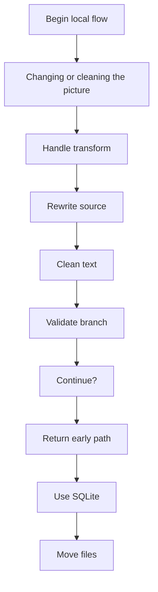
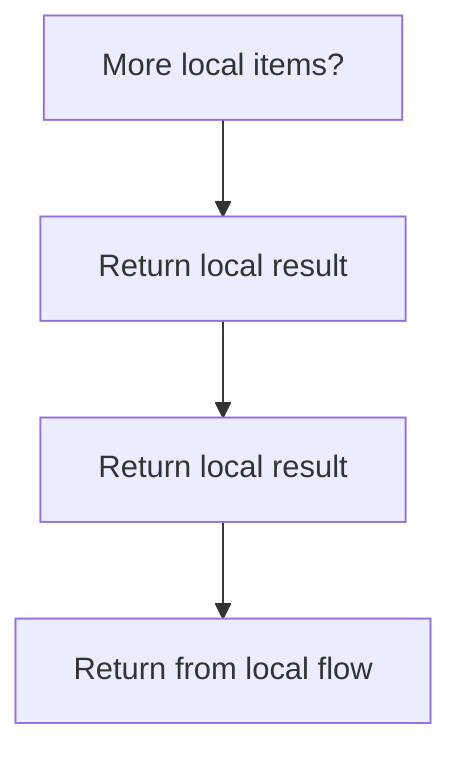
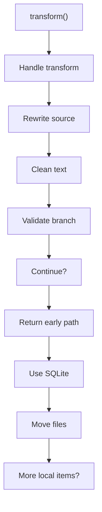
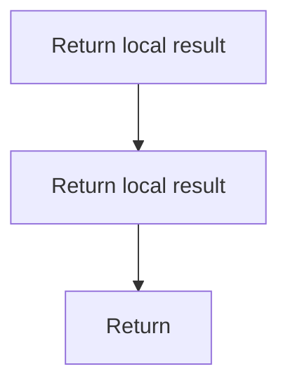

# transformController.js

- Source: Backend/src/controllers/transformController.js
- Kind: JavaScript module

## Story
### What Happens Here

This controller implements the current upload-to-placeholder-transform path. It validates the uploaded file, normalizes and relocates the input, creates an output placeholder, persists a job record, writes log entries, and returns the job metadata to the caller.

### Why It Matters In The Flow

Runs after routing and middleware resolution to perform request-specific backend work.

### What To Watch While Reading

Implements HTTP endpoint behavior after routing and before response serialization. The main surface area is easiest to track through symbols such as path, fs, db, and allowedExt. It collaborates directly with path, fs, ../db/database, and ../services/logService.

## Program Flow
This diagram follows the action path in plain words. Decision diamonds show where the file can stop, branch, or repeat work instead of simply passing through a straight line.

### Block 1 - Program Flow Details
#### Slice 1 - Continue Local Flow

#### Slice 2 - Continue Local Flow

## Reading Map
Read this file as: Implements HTTP endpoint behavior after routing and before response serialization.

Where it sits in the run: Runs after routing and middleware resolution to perform request-specific backend work.

Names worth recognizing while reading: path, fs, db, allowedExt, transform, and ext.

It leans on nearby contracts or tools such as path, fs, ../db/database, ../services/logService, and ../utils/fileUtils.

## Story Groups

### Changing Or Cleaning The Picture
These steps adjust existing state or remove stale pieces after better information is available.
- transform(): Rewrite source text or model state, normalize raw text before later parsing, and validate conditions and branch on failures

## Function Stories

### transform()
This routine owns one focused piece of the file's behavior.

Inside the body, it mainly handles rewrite source text or model state, normalize raw text before later parsing, validate conditions and branch on failures, and query or update SQLite state.

It branches on runtime conditions instead of following one fixed path. The caller receives a computed result or status from this step.

What it does:
- rewrite source text or model state
- normalize raw text before later parsing
- validate conditions and branch on failures
- query or update SQLite state
- move or write filesystem artifacts
- return the HTTP response

Flow:

### Block 2 - transform() Details
#### Slice 1 - Continue Local Flow

#### Slice 2 - Continue Local Flow

## Documentation Note
- This markdown file is part of the generated docs/Codebase mirror.
- It was generated from the repository state on 2026-04-23 after reading the existing docs corpus and the current source tree.
