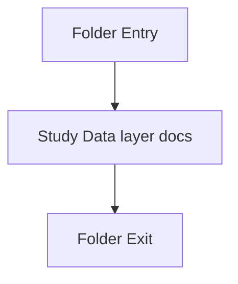

# db

- Folder: docs/Codebase/Backend/src/db
- Descendant source docs: 2
- Generated on: 2026-04-23

## Logic Summary
SQLite-oriented persistence helpers and schema initialization logic.

## Subsystem Story
This folder is mostly leaf-level. The local documents here carry the main explanation of the subsystem without requiring much extra descent.

## Folder Flow

## Documents By Logic
### Data Layer
These documents explain the local implementation by covering Owns SQLite connectivity and schema initialization..
- database.js.md : Owns SQLite connectivity and schema initialization.
- initDb.js.md : Owns SQLite connectivity and schema initialization.

## Reading Hint
- This folder is mostly leaf-level. Read the local file docs to understand the logic in this area.

