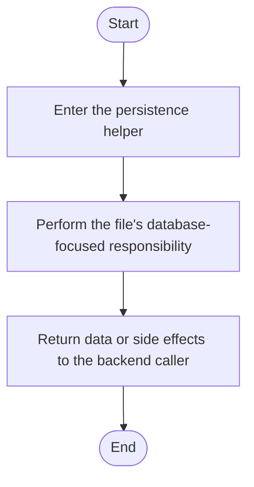

# database.js

- Source: Backend/src/db/database.js
- Kind: JavaScript module
- Lines: 6
- Role: Owns SQLite connectivity and schema initialization.
- Chronology: Supports backend startup and request-time persistence operations.

## Notable Symbols
- Database
- path
- dbPath
- db

## Direct Dependencies
- better-sqlite3
- path

## File Outline
### Responsibility

This file lives in the persistence layer of the backend. Its implementation supports startup-time or request-time SQLite operations used by the HTTP layer.

### Position In The Flow

Supports backend startup and request-time persistence operations.

### Main Surface Area

Owns SQLite connectivity and schema initialization. The main surface area is easiest to track through symbols such as Database, path, dbPath, and db. It collaborates directly with better-sqlite3 and path.

## File Activity

## Documentation Note
- This markdown file is part of the generated docs/Codebase mirror.
- It was generated from the repository state on 2026-04-23 after reading the existing docs corpus and the current source tree.

