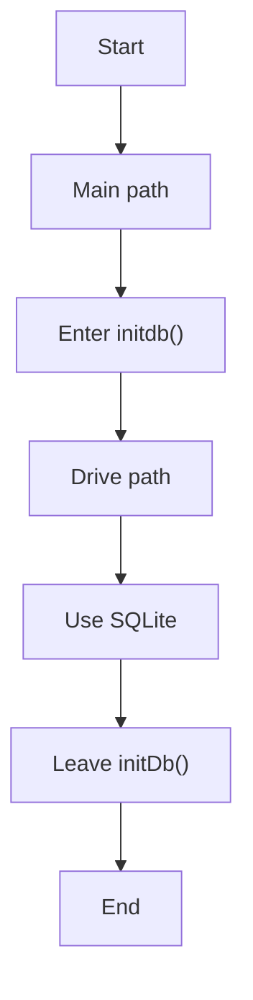
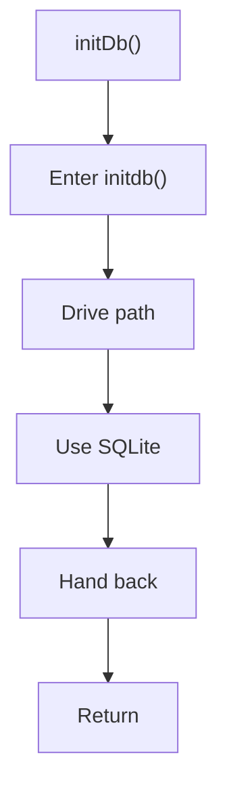

# initDb.js

- Source: Backend/src/db/initDb.js
- Kind: JavaScript module
- Lines: 33

## Story
### What Happens Here

This file implements the database bootstrapping sequence. It creates the users, jobs, and logs tables if they do not already exist so the backend can start in a valid persistence state. This file lives in the persistence layer of the backend. Its implementation supports startup-time or request-time SQLite operations used by the HTTP layer.

### Why It Matters In The Flow

Supports backend startup and request-time persistence operations.

### What To Watch While Reading

Owns SQLite connectivity and schema initialization. The main surface area is easiest to track through symbols such as initDb and db. It collaborates directly with ./database.

## Program Flow
This diagram follows the action path in plain words. Decision diamonds show where the file can stop, branch, or repeat work instead of simply passing through a straight line.

## Reading Map
Read this file as: Owns SQLite connectivity and schema initialization.

Where it sits in the run: Supports backend startup and request-time persistence operations.

Names worth recognizing while reading: initDb and db.

It leans on nearby contracts or tools such as ./database.

## Story Groups

### Main Path
These steps drive the main execution path by calling the supporting work in order.
- initDb() (line 2): Drive the main execution path and query or update SQLite state

## Function Stories

### initDb()
This routine prepares or drives one of the main execution paths in the file. It appears near line 2.

Inside the body, it mainly handles drive the main execution path and query or update SQLite state.

What it does:
- drive the main execution path
- query or update SQLite state

Flow:

## Documentation Note
- This markdown file is part of the generated docs/Codebase mirror.
- It was generated from the repository state on 2026-04-23 after reading the existing docs corpus and the current source tree.

