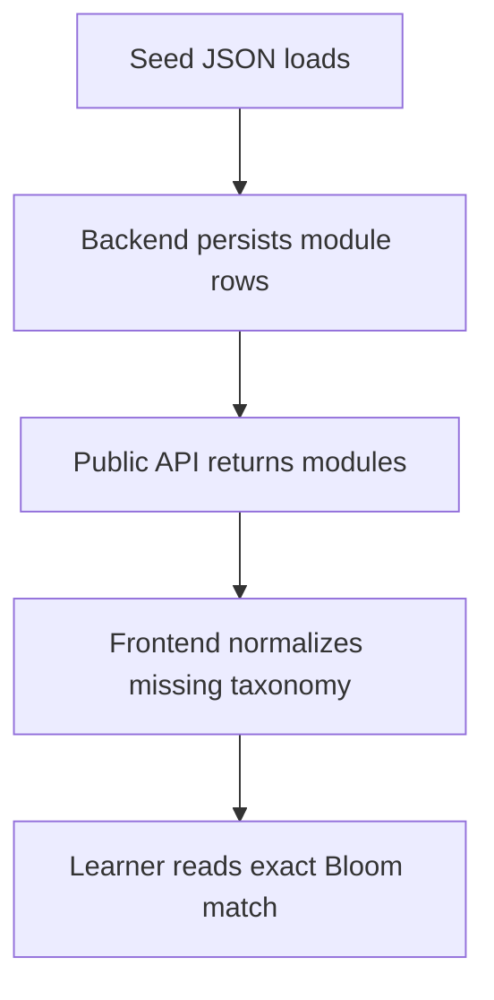

# `seeds`

- Folder: `docs/Codebase/Backend/src/db/seeds`
- Future source folder: `Codebase/Backend/src/db/seeds`

## Logic Summary
This folder documents seed data that initializes the learning CMS and other persisted catalogs. The seed contents are backend-owned data, but the frontend may still normalize them before use when the public API omits fields such as Bloom taxonomy.

## Read Order
1. `learningModules.seed.json.md` explains the learning-module seed payload and its role in the public catalog.

## Folder Flow

## Ownership Boundary

This folder owns persisted seed payloads only. Assessment selection, taxonomy inference, and score calculation remain frontend responsibilities.
