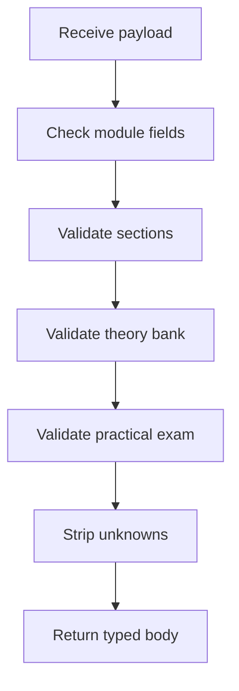

# `learning/index.ts`

## Sole job

Validate learning-module admin payloads before create, update, patch, and plan-apply routes persist them. The validator keeps the course CMS contract explicit while still accepting legacy MCQ questions that were saved before mixed question types existed.

## Question Contract

The theoretical question bank accepts three shapes:

- `mcq` - prompt, options, correct index, optional code snippet, optional explanation, optional Bloom taxonomy.
- `identification` - prompt, scenario, expected answer tokens, optional explanation, optional Bloom taxonomy.
- `studio` - Studio prompt, target pattern slug, optional starter code, optional explanation, optional Bloom taxonomy.

Every explicit taxonomy must be one of the six Bloom levels: remembering, understanding, applying, analyzing, evaluating, or creating.

## Validation Flow

## Compatibility Rules

- A question with options and no `type` is normalized to `type: "mcq"`.
- Invalid MCQ `correctIndex` values are rejected against the option count.
- Identification questions must have at least one non-empty expected token.
- Studio questions must have a prompt and target pattern slug.

## Acceptance Checks

- Mixed theory banks survive payload validation without being converted to MCQ.
- Incomplete identification and Studio items fail validation.
- Existing admin rows that omit `type` for MCQ questions remain saveable.
