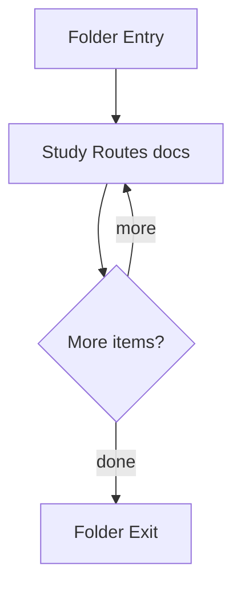

# routes

- Folder: docs/Codebase/Backend/src/routes
- Descendant source docs: 8
- Generated on: 2026-04-23

## Logic Summary
Route layer that maps URL paths to middleware chains and controller entrypoints. The live class-analysis route is a JSON endpoint separate from legacy file upload.

## Subsystem Story
This folder is mostly leaf-level. The local documents here carry the main explanation of the subsystem without requiring much extra descent.

## Folder Flow

## Documents By Logic
### Routes
These documents explain the local implementation by covering Maps HTTP routes to middleware and controllers.
- auth.js.md : Maps HTTP routes to middleware and controllers.
- admin.ts.md : Maps the admin analytics, configuration, and export endpoints to their route handlers.
- learning.ts.md : Maps public learning modules, learner progress, exam answers, and server-backed assessment history to their route handlers.
- googleAuth.ts.md : Maps Supabase Google OAuth callback handoff, token exchange, onboarding, invite, and join-request routes.
- health.js.md : Maps HTTP routes to middleware and controllers.
- transform.js.md : Maps the live class-analysis JSON endpoint and the legacy upload endpoint to their controller paths.
- projectLearningOrchestration.js.md : Maps the project-manager intake, intern assessment, and readiness review endpoints to their controller paths.

## Reading Hint
- This folder is mostly leaf-level. Read the local file docs to understand the logic in this area.

