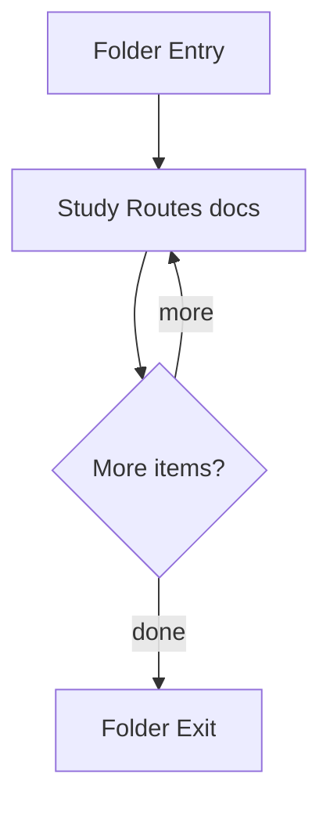

# routes

- Folder: docs/Codebase/Backend/src/routes
- Descendant source docs: 3
- Generated on: 2026-04-23

## Logic Summary
Route layer that maps URL paths to middleware chains and controller entrypoints.

## Subsystem Story
This folder is mostly leaf-level. The local documents here carry the main explanation of the subsystem without requiring much extra descent.

## Folder Flow

## Documents By Logic
### Routes
These documents explain the local implementation by covering Maps HTTP routes to middleware and controllers.
- auth.js.md : Maps HTTP routes to middleware and controllers.
- health.js.md : Maps HTTP routes to middleware and controllers.
- transform.js.md : Maps HTTP routes to middleware and controllers.

## Reading Hint
- This folder is mostly leaf-level. Read the local file docs to understand the logic in this area.

