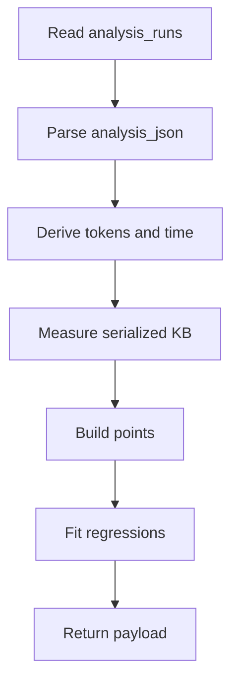
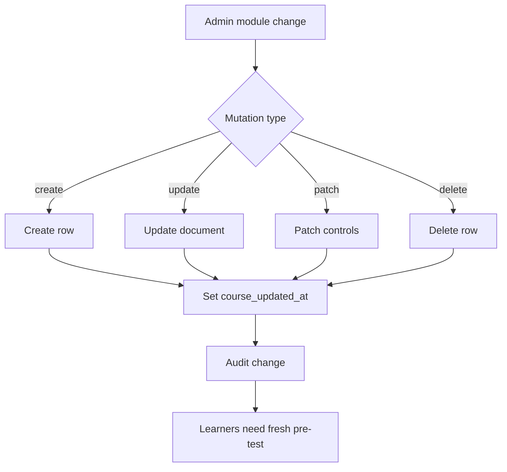
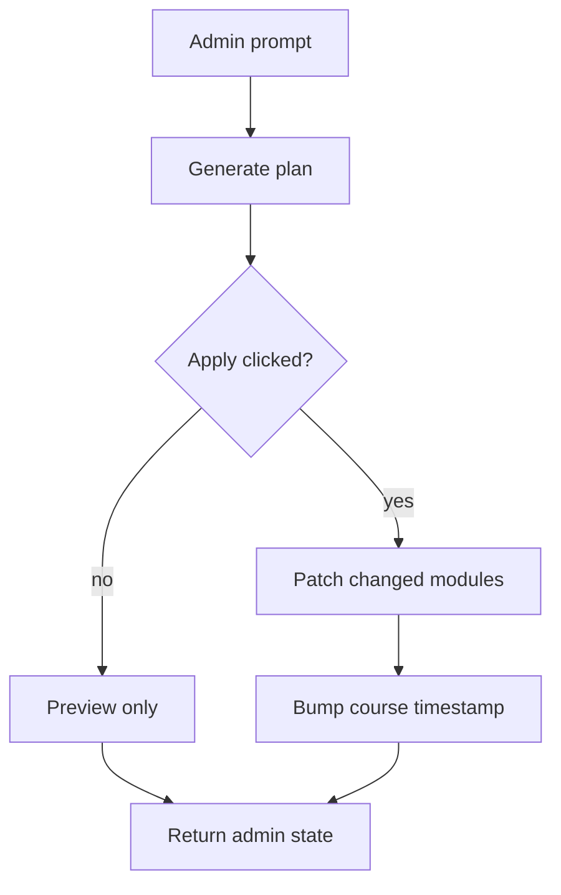
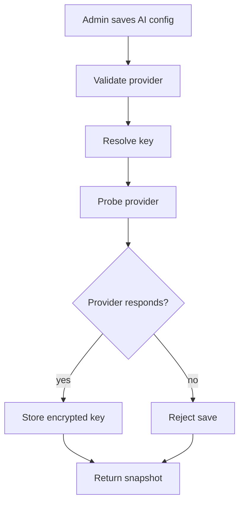

# admin.ts

- Source: `Backend/src/routes/admin.ts`
- Kind: Express router

## Story
### What Happens Here

This router owns the admin dashboard endpoints for analytics, saved runs, settings, exports, AI provider configuration, AI course-plan preview, and learning module administration. The complexity endpoint reads the saved-run corpus from `analysis_runs` and turns each persisted run into a regression point.

The backend does not invent a second persistence path for complexity data. The saved run is the source of truth, and Supabase only mirrors that same row through the existing row-mirror path.

The learning module CMS is also a source-of-truth path. Admin create, update, patch, and delete operations mutate `learning_modules` and bump the global `course_updated_at` setting so learner pre-test attempts from the old course version become stale.

### Why It Matters In The Flow

The admin Complexity tab depends on this router for the raw dataset. The endpoint returns the per-run values needed for the charts and for the CSV/JSON downloads in the frontend.

The admin Courses tab and Course planner depend on this router for reset semantics. Generating an AI course plan is preview-only and must not reset learners. Applying that plan calls the module patch route for changed modules, and those applied changes do reset learners through the same `course_updated_at` bump as manual module edits.

## Complexity Flow

## Learning Module Reset Flow

## AI Course Plan Flow

## AI Config Flow

## AI Config Route

- `GET /api/admin/ai-config` returns provider, model, key presence, and update metadata, never the plaintext key.
- `PUT /api/admin/ai-config` validates provider/model/key input, probes the selected provider, and only persists after the probe succeeds.
- `provider: "none"` clears the DB row and re-enables environment-variable fallback.
- A blank key keeps the existing encrypted key only when it belongs to the same selected provider.

## Learning CMS Routes

- `GET /api/admin/learning/modules` returns all modules, including drafts, for the admin list.
- `POST /api/admin/learning/modules` creates a module, validates the full module document, sets `course_updated_at`, audits `learning.module.create`, and mirrors the row.
- `PUT /api/admin/learning/modules/:moduleId` updates the full document while keeping `module_id` immutable, sets `course_updated_at`, audits `learning.module.update`, and mirrors the row.
- `PATCH /api/admin/learning/modules/:moduleId` changes only `published`, `autoTag`, and `sortOrder`, sets `course_updated_at`, audits `learning.module.patch`, and mirrors the whole resulting row.
- `DELETE /api/admin/learning/modules/:moduleId` removes a module, guards seed modules unless forced, sets `course_updated_at`, and audits `learning.module.delete`.

## Reset Semantics

- `course_updated_at` is the backend course-version marker consumed by `GET /api/learning/assessments`.
- Any successful module create, full update, control-field patch, or delete makes older saved pre-test attempts stale.
- Applied AI course plans are reset triggers only because they call the module patch route for changed published states.
- Preview-only AI course plans do not write `learning_modules`, do not set `course_updated_at`, and must not reset learners.

## Output Shape

The complexity payload includes:

- `points[]` with `runId`, `sourceName`, `createdAt`, `tokens`, `loc`, `patternCount`, `totalTargets`, `totalMs`, `items`, `serverWallUs`, and `analysisKb`
- `regression`
- `regressionByItems`
- `regressionSpaceByTokens`
- `regressionSpaceKbByTokens`
- `regressionWallUsByTokens`
- `regressionWallUsByTokensTrimmed`

## Acceptance Checks

- The router reads saved runs from `analysis_runs`, not from a separate complexity table.
- The payload carries per-run metadata so the frontend can export row-level data.
- The existing Supabase mirror remains best-effort and unchanged for this flow.
- No filesystem persistence is added for complexity data.
- AI provider config saves reject unreachable provider credentials before storing them.
- Learning module create/update/patch/delete set `course_updated_at`.
- Applied AI course plans reset learners through module patches.
- AI course-plan preview alone does not set `course_updated_at`.
