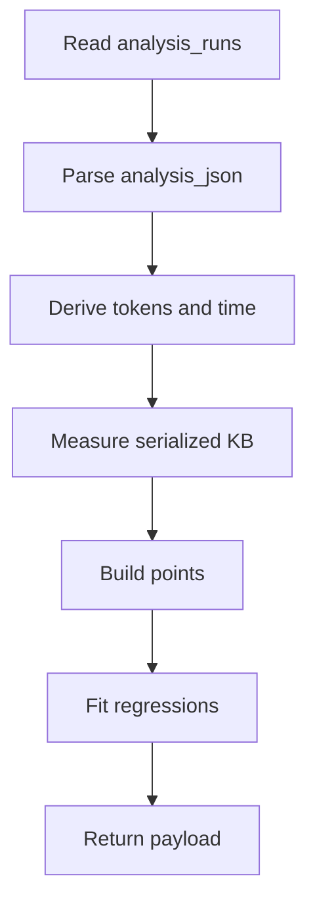

# admin.ts

- Source: `Backend/src/routes/admin.ts`
- Kind: Express router

## Story
### What Happens Here

This router owns the admin dashboard endpoints for analytics, saved runs, settings, and exports. The complexity endpoint reads the saved-run corpus from `analysis_runs` and turns each persisted run into a regression point.

The backend does not invent a second persistence path for complexity data. The saved run is the source of truth, and Supabase only mirrors that same row through the existing row-mirror path.

### Why It Matters In The Flow

The admin Complexity tab depends on this router for the raw dataset. The endpoint returns the per-run values needed for the charts and for the CSV/JSON downloads in the frontend.

## Complexity Flow

## Output Shape

The complexity payload includes:

- `points[]` with `runId`, `sourceName`, `createdAt`, `tokens`, `loc`, `patternCount`, `totalTargets`, `totalMs`, `items`, `serverWallUs`, and `analysisKb`
- `regression`
- `regressionByItems`
- `regressionSpaceByTokens`
- `regressionSpaceKbByTokens`
- `regressionWallUsByTokens`
- `regressionWallUsByTokensTrimmed`

## Acceptance Checks

- The router reads saved runs from `analysis_runs`, not from a separate complexity table.
- The payload carries per-run metadata so the frontend can export row-level data.
- The existing Supabase mirror remains best-effort and unchanged for this flow.
- No filesystem persistence is added for complexity data.
