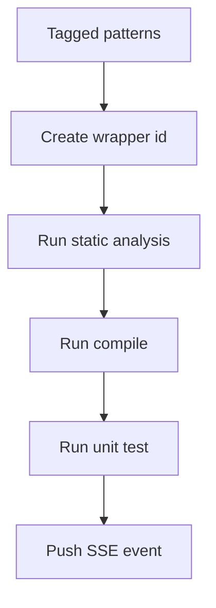

# analysis.ts

- Source: `Backend/src/routes/analysis.ts`
- Kind: analysis and test-run router

## Story
This router now dispatches tests as isolated wrapper instances instead of replaying shared prerequisite rows across patterns. Each tagged pattern/class gets its own wrapper id, but the wrapper still reuses the same user pod through the test runner service.

## Read Order
1. `handleRunTests()` for request validation, gating, and streaming setup.
2. `dispatchPatternTests()` for per-wrapper execution.
3. `generateWrapperId()` for wrapper identity creation.
4. `run-events` SSE route for delivery.

## Flow

## Boundary
- One request can fan out to many wrapper instances.
- The router does not create Docker pods directly.
- The legacy blocking path still returns the same flattened result list for older callers.

## Acceptance Checks
- Wrapper identity is attached before the result enters the SSE store.
- A failed compile only skips the unit-test phase for that wrapper.
- Streaming and non-streaming responses both carry the wrapper id.
