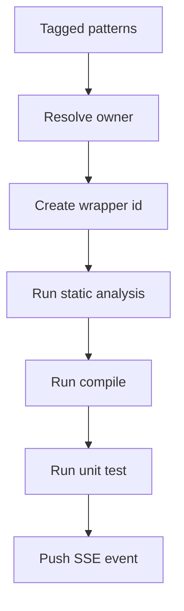

# analysis.ts

- Source: `Backend/src/routes/analysis.ts`
- Kind: analysis and test-run router

## Story
This router dispatches tests as isolated wrapper instances instead of replaying shared prerequisite rows across patterns. Each tagged pattern/class gets its own wrapper id, and each wrapper plan records whether it has a signed-in owner. Wrappers with the same owner share that user's Docker pod through the test runner service; ownerless wrappers stay on the local sandbox path.

## Read Order
1. `handleRunTests()` for request validation, gating, and streaming setup.
2. `buildWrapperExecutionPlans()` for the per-question wrapper split and owner policy.
3. `dispatchPatternTests()` for per-wrapper execution.
4. `generateWrapperId()` for wrapper identity creation.
5. `run-events` SSE route for delivery.

## Flow

## Boundary
- One request can fan out to many wrapper instances.
- The router does not create Docker pods directly.
- The legacy blocking path still returns the same flattened result list for older callers.
- Wrapper plans keep the source pattern attached so each question is tested in isolation without losing its original class metadata.
- Wrapper plans keep `wrapperOwnerKey` and `wrapperSharesDocker` beside `wrapperId`; the test runner decides whether that policy can use a pod.
- Per-wrapper phase errors are contained inside that wrapper. A thrown static-analysis, compile, or unit-test phase emits synthetic failure/skipped rows for that wrapper only and does not erase sibling wrapper results.

## Acceptance Checks
- Wrapper identity is attached before the result enters the SSE store.
- Synthetic failure rows also carry wrapper identity and owner policy.
- A failed compile only skips the unit-test phase for that wrapper.
- A thrown phase in one wrapper does not poison the rest of the multi-question batch.
- Streaming and non-streaming responses both carry the wrapper id.
