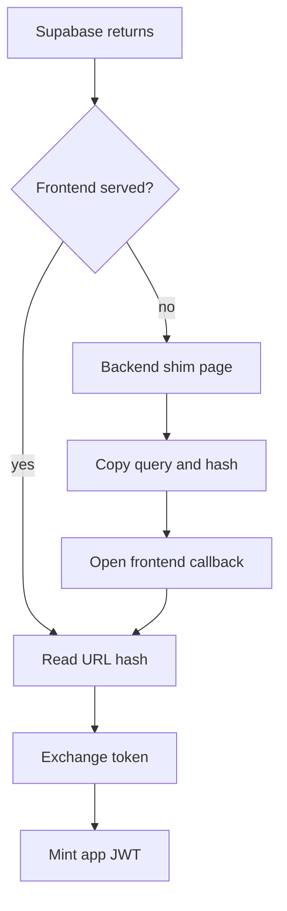
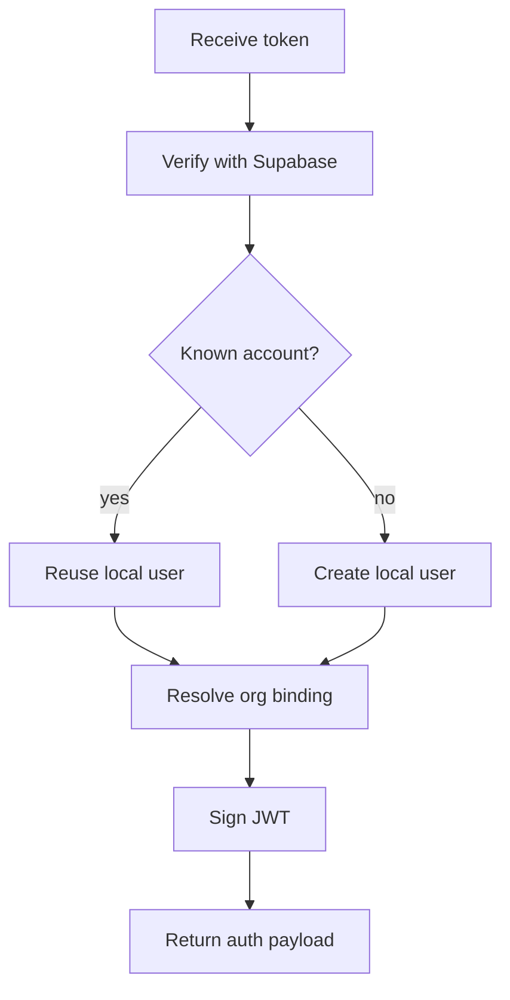

# googleAuth.ts

- File: Codebase/Backend/src/routes/googleAuth.ts
- Owner: Backend auth routes

## Purpose
Owns Google sign-in integration with Supabase Auth. The route verifies the Supabase access
token, upserts the local user, binds admin or developer onboarding state, and mints the app
JWT used by the rest of NeoTerritory.

## Deployment Contract
Google sign-in only works when the live backend receives the Supabase auth vars and the
Google OAuth vars that Supabase needs. The bash deploy path already forwards that set; the
PowerShell AWS deploy path must mirror it so the production container sees the same auth
environment on every restart.

## Callback Boundary
The frontend owns `/auth/callback` because Supabase puts the session in the URL fragment.
The backend keeps a compatibility `GET /auth/callback` page only for misrouted or direct
backend-origin callbacks. That page runs in the browser, copies `window.location.search` and
`window.location.hash`, and forwards the user to the configured frontend origin.

The real token exchange remains `POST /auth/google/exchange`.

## Callback Flow

## Route Flow

## Acceptance Checks
- Backend `/auth/callback` returns no-store HTML instead of `Cannot GET /auth/callback`.
- The shim preserves `window.location.hash`; it must not use a server-only 302.
- The shim response sets its own restrictive CSP so Helmet does not block the inline handoff script.
- `/auth/google/exchange` continues to reject missing or invalid Supabase tokens.
- PowerShell AWS deploy restarts must carry `AUTH_PROVIDER`, `AUTH_SUPABASE_ANON_KEY`, and
  `GOOGLE_OAUTH_*` into the remote container the same way the bash deploy path does.
