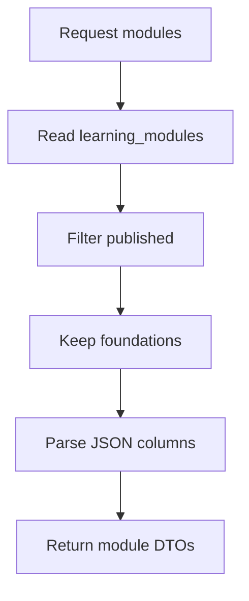
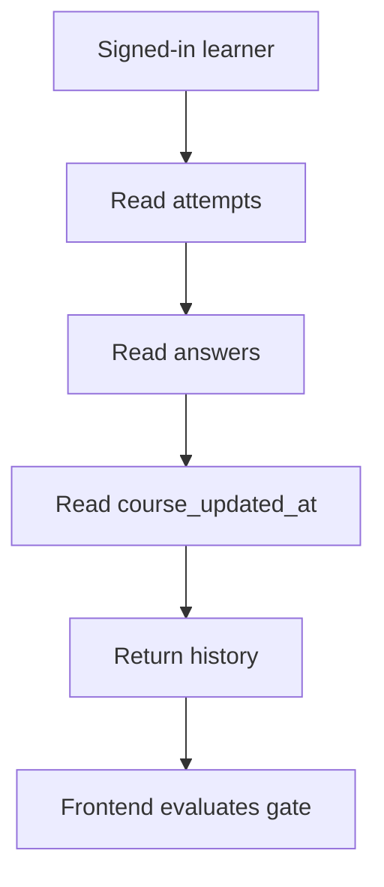
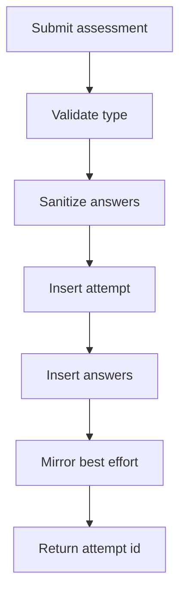
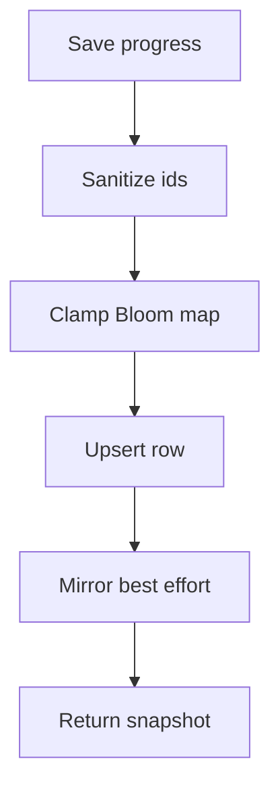

# learning.ts

- Source: `Backend/src/routes/learning.ts`
- Kind: Express router

## Story

### What Happens Here

This router owns the learner-facing learning API. It serves the public module bank, persists signed-in learner progress, records per-question exam answers, records assessment attempts, and returns saved assessment history with the current course freshness timestamp.

The route treats SQLite as the source of truth. Supabase mirrors are best-effort copies for durability and reporting; they do not decide whether a learner can enter the course.

### Why It Matters In The Flow

The learning path relies on this router to make pre-test gating durable across refreshes and devices. The frontend can keep a local pre-test flag for immediate UI continuity, but the route-level assessment history and `courseUpdatedAt` value decide whether a saved passing pre-test is still fresh after admin course edits.

Per-module Bloom mastery also lives in the learner progress snapshot. The value is a JSON map of `moduleId -> 0..6`, where `0` means no saved mastery and `6` means the module can be exempted for that learner.

## Learner Module Flow

## Assessment History Flow

## Assessment Write Flow

## Progress Write Flow

## Route Contracts

- `GET /api/learning/modules` is public and returns published modules plus foundation modules, ordered by `sort_order`.
- `GET /api/learning/progress` requires auth and returns completed module ids, last unlocked module id, theoretical-pass module ids, and `bloomMasteryByModule`.
- `PUT /api/learning/progress` requires auth and upserts sanitized progress for the user and optional session; `bloomMasteryByModule` values are clamped to `0..6`.
- `PUT /api/learning/answers` requires auth and records module theoretical exam answers plus an append-only exam attempt row.
- `GET /api/learning/assessments` requires auth and returns `attempts`, `answers`, and `courseUpdatedAt`.
- `PUT /api/learning/assessments` requires auth and records pre-test, post-test, post-test-2, or practical assessment answers as an append-only attempt.

## Fresh Pre-Test Semantics

- `courseUpdatedAt` is read from the `course_updated_at` app setting.
- The frontend ignores pre-test attempts created before `courseUpdatedAt`.
- The backend does not delete old attempts when an admin changes the course; old rows remain historical evidence but are no longer gate-valid.
- A fresh pre-test means the learner has an assessment attempt with recorded answers created after the latest admin course reset trigger.

## Reset Triggers

The reset timestamp is written by the admin router, not this learner router. These learner-visible changes make previous pre-tests stale:
- admin module create
- admin module full update
- admin module publish / auto-tag / sort-order patch
- admin module delete
- applied AI course plan, because it patches changed module publish states

Preview-only AI course plans do not call this router, do not mutate modules, and do not change `course_updated_at`.

## Acceptance Checks

- Public module reads stay non-cacheable so learner content reflects admin changes promptly.
- Assessment history includes `courseUpdatedAt` alongside attempts and answers.
- Assessment writes are append-only and preserve old attempts for analytics.
- Progress reads and writes preserve the per-user, per-module Bloom mastery map.
- Freshness is enforced by comparing attempt creation time to `courseUpdatedAt` and requiring recorded answer rows, not by deleting learner data.
- Preview-only AI course plan generation cannot reset learners.
