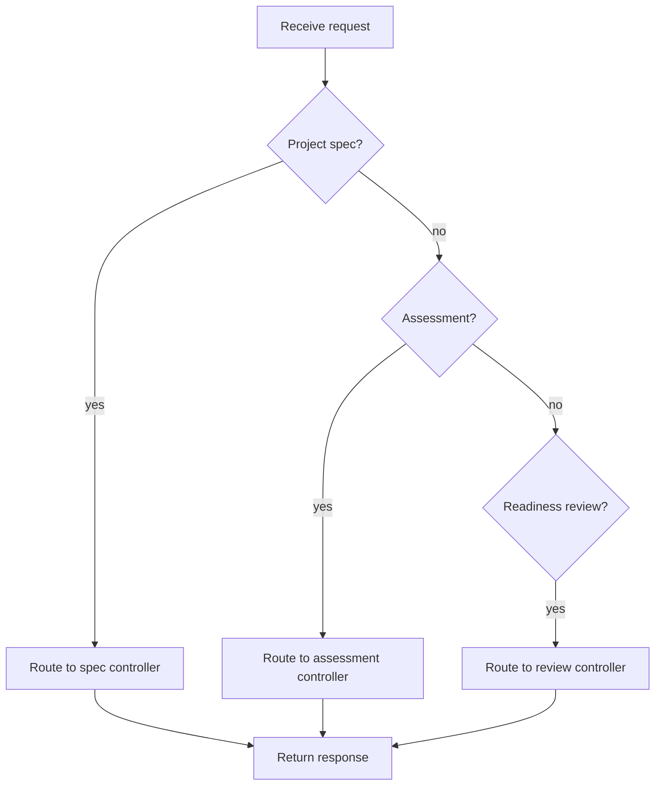

# projectLearningOrchestration.js

- Source: `Backend/src/routes/projectLearningOrchestration.js`
- Kind: JavaScript route module

## Story
### What Happens Here

This route module maps the tailored project-learning workflow into HTTP entrypoints. It keeps the project-manager intake, intern assessment, and readiness review paths separate, but all of them share the same project-learning boundary.

The route layer should remain thin. It should only select the endpoint, apply the needed auth/role middleware, and hand the request to the controller.

### Why It Matters In The Flow

This is the public backend face of the new workflow. It controls which user role can reach which stage:
- project manager for project brief intake and readiness review.
- intern for pretest, module study, and posttest submission.
- system-internal policy for scope and toggle calculation.

### What To Watch While Reading

Keep routing narrow:
- the route decides the URL and middleware chain.
- the controller validates request bodies and coordinates services.
- services own scope extraction, feature toggles, assessment state, and evidence packaging.

## Route Flow

## Intended Routes

- `POST /api/project-learning/projects/:projectId/spec`
  - Project manager brief intake.
  - Accepts business specs, architecture constraints, and process notes.
  - Produces a normalized project-learning scope.

- `POST /api/project-learning/projects/:projectId/scope`
  - System scope and toggle resolution.
  - Accepts the AI-derived scope result.
  - Produces an explicit module toggle manifest.

- `POST /api/project-learning/projects/:projectId/interns/:internId/pretest`
  - Intern pretest submission.
  - Accepts answers for only the project-scoped topics.
  - Produces a pass, fail, or retry decision.

- `POST /api/project-learning/projects/:projectId/modules/:moduleId/posttest`
  - Intern posttest submission.
  - Accepts answers after a module or section completes.
  - Produces a pass, fail, or retry decision.

- `GET /api/project-learning/projects/:projectId/readiness`
  - Project manager review surface.
  - Returns the ready suggestion plus evidence package.

## Acceptance Checks

- The route layer does not contain business logic for scope extraction or scoring.
- The route layer keeps project-manager and intern endpoints separate.
- The route layer can support a suggestion-style readiness review without hiding evidence endpoints.
- The route layer can be extended without changing the assessment service contract.
