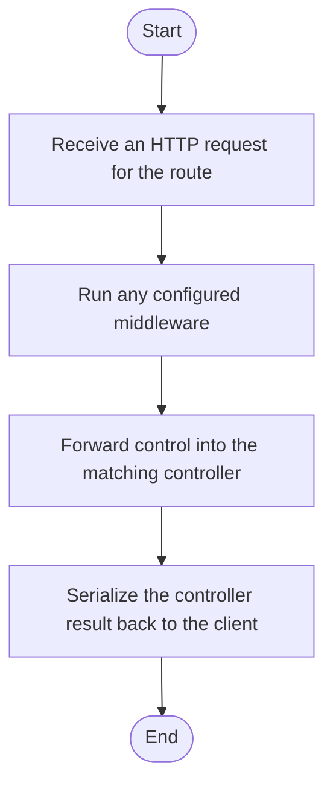

# transform.js

- Source: Backend/src/routes/transform.js
- Kind: JavaScript module
- Lines: 10
- Role: Maps HTTP routes to middleware and controllers.
- Chronology: Reached after Express accepts a request and before controller logic executes.

## Notable Symbols
- express
- router

## Direct Dependencies
- express
- ../middleware/jwtAuth
- ../controllers/transformController
- ../middleware/upload

## Implementation Story
This route file is a traffic director rather than a business-logic endpoint. Its implementation wires HTTP verbs and paths to the middleware chain and then forwards the request into the controller that performs the real work. Maps HTTP routes to middleware and controllers. Reached after Express accepts a request and before controller logic executes. The implementation surface is easiest to recognize through symbols such as express and router. In practice it collaborates directly with express, ../middleware/jwtAuth, ../controllers/transformController, and ../middleware/upload.

## Activity Diagram

## Documentation Note
- This markdown file is part of the generated docs/Codebase mirror.
- It was generated from the repository state on 2026-04-22 after reading the existing docs corpus and the current source tree.

