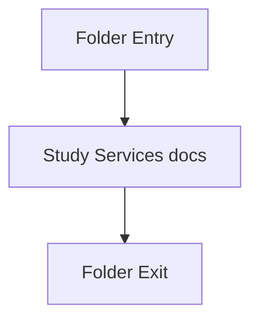

# services

- Folder: docs/Codebase/Backend/src/services
- Descendant source docs: 1
- Generated on: 2026-04-23

## Logic Summary
Reusable backend support services called from controllers or middleware.

## Subsystem Story
This folder is mostly leaf-level. The local documents here carry the main explanation of the subsystem without requiring much extra descent.

## Folder Flow

## Documents By Logic
### Services
These documents explain the local implementation by covering Provides backend support services used across request handlers.
- logService.js.md : Provides backend support services used across request handlers.

## Reading Hint
- This folder is mostly leaf-level. Read the local file docs to understand the logic in this area.

