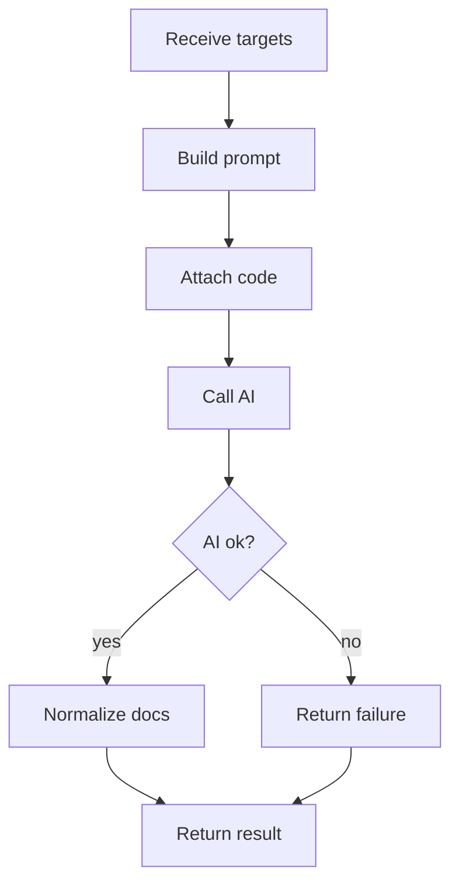

# aiDocumentationService.js

- Source: `Backend/src/services/aiDocumentationService.js`
- Kind: JavaScript service

## Story
### What Happens Here

This service owns the backend AI documentation handoff. It receives detected design-pattern evidence, documentation targets, unit-test targets, and the exact code excerpts to document. It then builds the AI request and normalizes the generated documentation result.

The AI must be called from the backend, not from the frontend, so API keys, model settings, prompt templates, and retries remain server-side.

### Why It Matters In The Flow

The documentation generator needs the actual code that was selected by the algorithm. The frontend should not guess which code to document. This service guarantees the AI receives the code units tied to detected design-pattern evidence.

### What To Watch While Reading

Keep AI input grounded in analysis output:
- detected pattern from cross-referencing.
- documentation targets from the documentation tagger.
- unit-test targets from the same evidence.
- code excerpts copied from the analyzed class slice or source file.

## AI Flow



## AI Request Payload

The service should build a provider-neutral internal payload before converting it to the configured AI provider request.

```json
{
  "task": "document_detected_design_pattern_code",
  "detectedPattern": "factory",
  "language": "cpp",
  "documentationTargets": [
    {
      "targetId": "factory:Factory:create:branch-0",
      "tagType": "factory_branch",
      "symbolName": "Factory::create",
      "documentationHint": "Explain how this branch participates in Factory creation.",
      "codeExcerpt": "if (kind == \"A\") return new ProductA();"
    }
  ],
  "unitTestTargets": [
    {
      "targetId": "factory:Factory:create:branch-0",
      "testKind": "factory_branch_selection",
      "expectedBehavior": "Selecting kind A creates ProductA.",
      "codeExcerpt": "if (kind == \"A\") return new ProductA();"
    }
  ]
}
```

## AI Output Shape

```json
{
  "status": "generated",
  "sections": [
    {
      "targetId": "factory:Factory:create:branch-0",
      "title": "Factory branch for ProductA",
      "documentation": "Generated explanation text.",
      "testCaseNotes": "Generated unit-test guidance."
    }
  ]
}
```

## Failure Behavior

AI failure must not erase successful lexical, subtree, or cross-reference analysis. Return analysis results with:
- `aiDocumentation.status`: `failed`.
- `aiDocumentation.error`: short backend-safe reason.
- documentation and unit-test targets unchanged.

## Acceptance Checks

- AI input includes the actual code excerpts to document.
- AI input uses detected pattern evidence, not user-selected source/target patterns.
- AI output is grouped by `targetId`.
- AI failure still returns documentation and unit-test target metadata.

---

## D37 Refinements (workshop-graduate persona, chunked pipeline)

The fields above describe the early `targetId`-shaped contract. The current pipeline (per `docs/Codebase/DESIGN_DECISIONS.md` D37) extends the service with a class-shaped contract optimised for the studio's "Generate documentation" button. Both shapes coexist: legacy callers that pass `documentationTargets[]` keep working; new callers use the class-shaped path described below.

### Trigger and lifecycle

- Entry: `POST /api/runs/:runId/document` returns `202 Accepted` and the job state immediately. Status: `GET /api/runs/:runId/document` returns the latest snapshot. Both routes live under the existing analysis route file.
- Job runs are non-blocking — kicked off via `setImmediate` after the POST responds. The frontend polls the status endpoint.
- One job per `runId`. If a job is already running for that runId, the POST returns the existing job state instead of starting a duplicate.

### System prompt (persona)

Audience is workshop graduates: they recognize GoF patterns and have seen canonical UML. They need the bridge from "abstract pattern" to "this exact code", not a textbook re-introduction. The system prompt MUST instruct the model to:

- never re-teach the pattern,
- never open with "a Builder is…" or any equivalent definition prefix,
- speak as a senior developer pointing out *where* the pattern lives in the user's code,
- emit ONLY the JSON schema below, no prose, no markdown fences.

The persona is implicit. It is never surfaced in the output text the user sees.

### Request payload (per chunk, class-shaped)

```json
{
  "language": "cpp",
  "classes": [
    {
      "className": "PizzaBuilder",
      "file": "src/PizzaBuilder.cpp",
      "lineRange": [42, 71],
      "code": "<exact source slice>",
      "taggedPattern": "Builder",
      "candidatePatterns": [
        { "name": "Factory Method", "score": 0.62 },
        { "name": "Prototype",      "score": 0.31 }
      ]
    }
  ]
}
```

`runId` is intentionally absent from the AI payload. The backend owns it via the route and stores results against it. `candidatePatterns` carries the runner-up evidence the AI uses for the comparative narrative — the microservice's actual scoring is unchanged.

### Response payload (per class, strict)

```json
{
  "classes": [
    {
      "name": "PizzaBuilder",
      "file": "src/PizzaBuilder.cpp",
      "taggedPattern": "Builder",
      "patternRoleInThisClass": "Concrete Builder",
      "patternLineRange": [44, 68],
      "summary": "1-2 sentence intent",
      "lineExplanations": [
        { "line": 44, "note": "Initializes accumulator state separate from the product so partial state survives across calls." }
      ],
      "chosenRationale": "Why Builder fits THIS code — concrete observation about lines 44-68.",
      "runnerUpComparison": {
        "name": "Factory Method",
        "gap":  "Factory Method matches construction but lacks the step-accumulation visible at lines 50-62."
      }
    }
  ]
}
```

`lineExplanations` is **salient-only**: the AI picks up to ~8 load-bearing lines per class, not every line in `patternLineRange`. The salience target is "what would a senior dev highlight in a code review", not "annotate every statement".

### Chunking

- Hard cap: **5 chunks per run**. If `classes.length` would push past 5 chunks, classes are batched to fit.
- Order: sequential, with a configurable delay between calls (default ~1.5s) to avoid 429 from the AI provider.
- `totalChunks` is computed and saved into job state BEFORE the first AI call. The frontend uses it to render "Chunk 2 / 5" progress.

### Job state (in-memory only)

```ts
type DocJobState = {
  runId: string;
  status: 'queued' | 'running' | 'success' | 'failed' | 'cancelled';
  totalChunks: number;
  completedChunks: number;
  startedAt: number;
  finishedAt?: number;
  results: ClassDoc[];        // accumulated per chunk
  failureReason?: string;     // populated on 'failed'
};

const docJobs = new Map<string, DocJobState>();
```

Lost on backend restart by design — the user re-triggers from the studio. No SQLite migration.

### Timeouts (per chunk)

| Elapsed | Behavior |
|---|---|
| 30s | Frontend renders a "Skip AI, use static" button. Clicking it cancels the job (`status: 'cancelled'`) and renders the static fallback for every class in the run. |
| 60s | Backend hard-aborts the chunk. Job flips to `status: 'failed'` with `failureReason: 'ai_timeout'`. Frontend shows "AI did not respond — using static documentation" and renders the fallback automatically. |

The 30s and 60s clocks are per-chunk. A 5-chunk job that consistently takes 25s per chunk does NOT trigger either timeout.

### Validation

A chunk response is accepted only if:
1. The AI provider returned an HTTP success (2xx).
2. The body parses cleanly against the JSON schema above (Zod or equivalent — recommended location: `Backend/src/services/docResponseSchema.ts`).

Either check failing flips the job to `status: 'failed'` and triggers the static fallback. The frontend never receives a malformed body.

### Static fallback (catalog-side)

Each pattern folder under `Codebase/Microservice/pattern_catalog/<pattern>/` ships a `fallback_doc.json`. Shape:

```json
{
  "patternRoleByEvidence": {
    "concrete_builder": "Concrete Builder",
    "director":         "Director"
  },
  "summaryTemplate":     "{{className}} plays the {{patternRole}} role in the {{taggedPattern}} pattern. The pattern body lives at lines {{lineStart}}-{{lineEnd}}.",
  "chosenRationaleTemplate": "Microservice tagged {{className}} as {{taggedPattern}} based on {{evidenceKind}} evidence at lines {{lineStart}}-{{lineEnd}}.",
  "lineExplanationTemplates": {
    "concrete_builder": [
      { "linePicker": "first",  "note": "Builder entry point — receives the request to start accumulating product state." },
      { "linePicker": "last",   "note": "Builder finalizer — emits the assembled product." }
    ]
  }
}
```

Substitution data comes purely from microservice output (class name, file, line range, evidence kind, parameter list). No AI call is made on the fallback path. Quality is intentionally lower than the AI version, but it never blocks the user, and the user can still browse + download docs.

### Acceptance Checks (D37 layer)

- POST returns 202 with the initial job state; subsequent GET returns the same `runId`'s state.
- The studio's download buttons are disabled while `status` is `queued` or `running`, replaced with a "Waiting for AI to respond…" indicator.
- `totalChunks` is set before the first AI call and never re-set during the run.
- A response that fails JSON-schema validation does NOT reach the frontend; the job flips to `failed`.
- A 30s elapsed-on-current-chunk surfaces the "Skip AI, use static" button in the frontend status response.
- A 60s elapsed-on-current-chunk auto-fails the job and the frontend renders the catalog-side fallback.
- Microservice and backend pattern-detection scoring are NOT touched by this pipeline. The "why X won over Y" narrative is AI-generated string, not a re-score.
