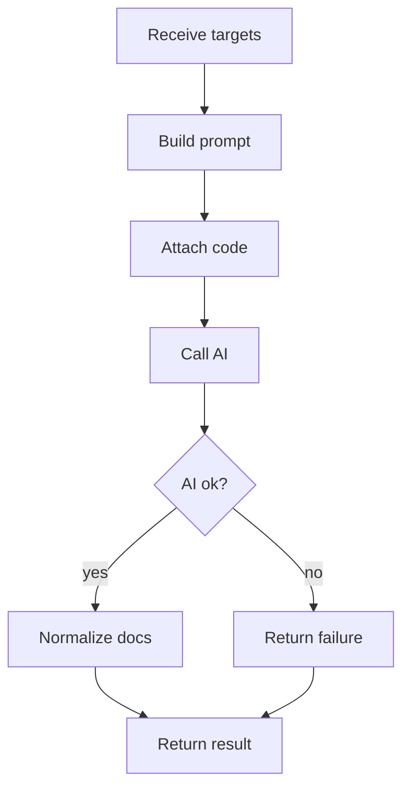

# aiDocumentationService.js

- Source: `Backend/src/services/aiDocumentationService.js`
- Kind: JavaScript service

## Story
### What Happens Here

This service owns the backend AI documentation handoff. It receives detected design-pattern evidence, documentation targets, unit-test targets, and the exact code excerpts to document. It then builds the AI request and normalizes the generated documentation result.

The AI must be called from the backend, not from the frontend, so API keys, model settings, prompt templates, and retries remain server-side.

### Why It Matters In The Flow

The documentation generator needs the actual code that was selected by the algorithm. The frontend should not guess which code to document. This service guarantees the AI receives the code units tied to detected design-pattern evidence.

### What To Watch While Reading

Keep AI input grounded in analysis output:
- detected pattern from cross-referencing.
- documentation targets from the documentation tagger.
- unit-test targets from the same evidence.
- code excerpts copied from the analyzed class slice or source file.

## AI Flow



## AI Request Payload

The service should build a provider-neutral internal payload before converting it to the configured AI provider request.

```json
{
  "task": "document_detected_design_pattern_code",
  "detectedPattern": "factory",
  "language": "cpp",
  "documentationTargets": [
    {
      "targetId": "factory:Factory:create:branch-0",
      "tagType": "factory_branch",
      "symbolName": "Factory::create",
      "documentationHint": "Explain how this branch participates in Factory creation.",
      "codeExcerpt": "if (kind == \"A\") return new ProductA();"
    }
  ],
  "unitTestTargets": [
    {
      "targetId": "factory:Factory:create:branch-0",
      "testKind": "factory_branch_selection",
      "expectedBehavior": "Selecting kind A creates ProductA.",
      "codeExcerpt": "if (kind == \"A\") return new ProductA();"
    }
  ]
}
```

## AI Output Shape

```json
{
  "status": "generated",
  "sections": [
    {
      "targetId": "factory:Factory:create:branch-0",
      "title": "Factory branch for ProductA",
      "documentation": "Generated explanation text.",
      "testCaseNotes": "Generated unit-test guidance."
    }
  ]
}
```

## Failure Behavior

AI failure must not erase successful lexical, subtree, or cross-reference analysis. Return analysis results with:
- `aiDocumentation.status`: `failed`.
- `aiDocumentation.error`: short backend-safe reason.
- documentation and unit-test targets unchanged.

## Acceptance Checks

- AI input includes the actual code excerpts to document.
- AI input uses detected pattern evidence, not user-selected source/target patterns.
- AI output is grouped by `targetId`.
- AI failure still returns documentation and unit-test target metadata.
