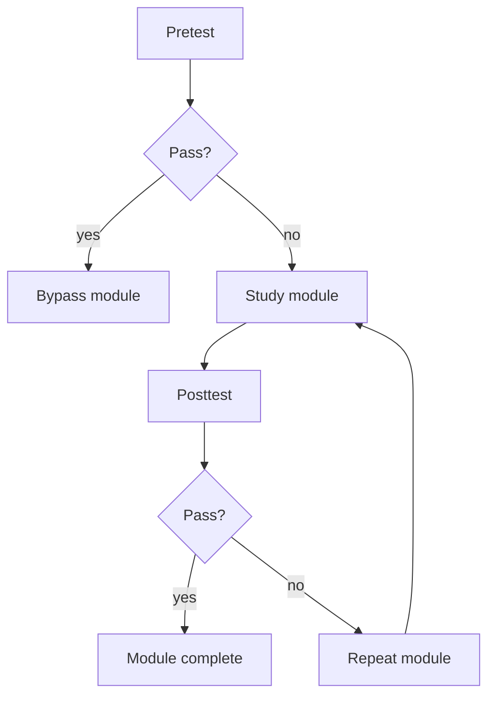

# assessmentOrchestrationService.js

- Source: `Backend/src/services/assessmentOrchestrationService.js`
- Kind: JavaScript service

## Story
### What Happens Here

This service runs the project-scoped pretest, module study bypass, and posttest loop. It decides whether the intern already knows the scoped material, whether they should skip a module, and whether they need to repeat the module after a failed posttest.

### Why It Matters In The Flow

This is the learning gate for the intern side. It keeps the training narrow and project-specific, and it stops the system from making interns study material they already proved they know.

### What To Watch While Reading

Keep the pass/fail loop local:
- pretest can bypass a module.
- failed pretest routes into module study.
- posttest controls repetition or completion.

## Service Flow



## Input Contract

```json
{
  "projectId": "proj-1024",
  "internId": "int-44",
  "moduleId": "adapter",
  "attemptType": "pretest",
  "answers": [
    { "questionId": "q1", "answer": "..." }
  ]
}
```

## Output Contract

```json
{
  "projectId": "proj-1024",
  "internId": "int-44",
  "moduleId": "adapter",
  "attemptType": "pretest",
  "decision": "pass",
  "nextAction": "bypass-module",
  "score": 92,
  "waivedSections": ["adapter-introduction", "adapter-usage"]
}
```

## Acceptance Checks

- A passing pretest skips the matching module sections for that intern on that project.
- A failing pretest routes the intern into the module study path.
- A passing posttest ends the current module or section.
- A failing posttest sends the intern back through the module.
- The service does not broaden the scope beyond the project-scoped topics.
