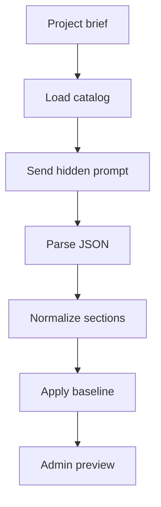

# coursePlannerService.ts

- Source: `Backend/src/services/coursePlannerService.ts`
- Kind: TypeScript service

## Story
### What Happens Here

This service turns a project brief into a JSON course plan for admin review. It sends a hidden system prompt to the configured AI provider and passes only planner-controlled learning modules as data.

The prompt contains a detailed pattern guide. For each supported design pattern, the guide explains the pattern in business terms, not textbook theory. For each supported design pattern, the guide explains:
- the main concept.
- the concepts that must be present before the pattern is needed.
- situations where the pattern is needed.
- situations where the pattern should not be selected.
- concrete subscenarios that give the model matching context.
- nearby patterns that should not be confused with it.
- one final selection test.

### Why It Matters In The Flow

The admin prompt should not need to explain JSON shape or pattern theory. The project manager writes only the project brief. The system prompt owns the schema and pattern-selection rubric. Baseline foundation modules are not described to the model and are enforced later by backend policy.

The prompt now allows several distinct patterns when the brief clearly contains several independent business forces. Up to five pattern modules can be selected when the scenario supports them, but the model should still stay narrow and avoid redundant fallbacks.

The planner uses implicit deny:
- missing sections are off.
- missing modules are off.
- selected pattern modules are on.
- baseline foundation modules remain on by server policy and are not AI-controlled.

The fallback heuristic now emits a compact pattern audit so the admin preview can explain why the top candidates won or lost. The audit keeps the strong matches visible without turning the panel into an opaque score dump.

## Planner Flow

## Pattern Matching Rules

The model should match by structural need, not pattern name alone. A signal word such as `logger`, `workflow`, `wrapper`, or `event` is not enough by itself.

Before selecting a pattern, the prompt tells the model to check:
- whether the brief satisfies the pattern selection test.
- whether at least one needed situation or subscenario applies.
- whether a `doNotUseWhen` condition is the stronger match.
- whether a nearby pattern is more specific.

The backend heuristic follows the same business-language rule set. It does not default to Adapter just because the prompt mentions integration-like language, and it keeps low-signal briefs from auto-selecting a random top pattern.

## Acceptance Checks

- The user prompt can stay as a normal project brief.
- The hidden system prompt contains the required JSON shape.
- The hidden system prompt contains detailed use and non-use guidance per pattern.
- The hidden system prompt teaches patterns through business scenarios, not only through technical jargon.
- The hidden system prompt allows up to five distinct pattern modules when the brief supports multiple forces.
- The hidden system prompt does not mention baseline foundation policy.
- The AI payload excludes baseline foundation modules.
- Backend normalization forces baseline foundation modules on.
- Fallback heuristic scoring reads the same pattern guide fields used by the AI prompt.
- The fallback preview exposes a pattern audit with the strongest candidates, their scores, and a short rejection reason when they are not selected.
- The planner still returns the existing `course-plan-v1` response shape.
