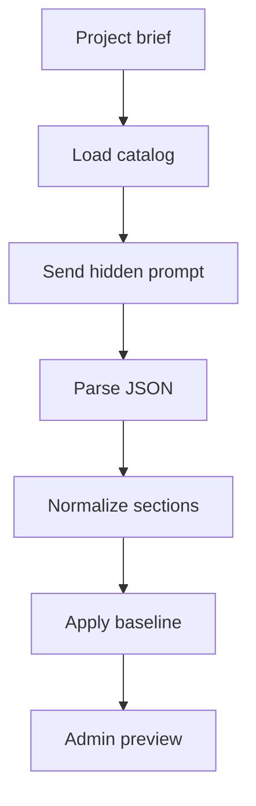

# coursePlannerService.ts

- Source: `Backend/src/services/coursePlannerService.ts`
- Kind: TypeScript service

## Story
### What Happens Here

This service turns a project brief into a JSON course plan for admin review. It sends a hidden system prompt to the configured AI provider and passes the current learning-module catalog as data.

The prompt contains a detailed pattern guide. For each supported design pattern, the guide explains:
- the main concept.
- the concepts that must be present before the pattern is needed.
- situations where the pattern is needed.
- situations where the pattern should not be selected.
- concrete subscenarios that give the model matching context.
- nearby patterns that should not be confused with it.
- one final selection test.

### Why It Matters In The Flow

The admin prompt should not need to explain JSON shape or pattern theory. The project manager writes only the project brief. The system prompt owns the schema, the baseline-foundation policy, and the pattern-selection rubric.

The planner uses implicit deny:
- missing sections are off.
- missing modules are off.
- selected pattern modules are on.
- baseline foundation modules remain on when any project course plan exists.

## Planner Flow

## Pattern Matching Rules

The model should match by structural need, not pattern name alone. A signal word such as `logger`, `workflow`, `wrapper`, or `event` is not enough by itself.

Before selecting a pattern, the prompt tells the model to check:
- whether the brief satisfies the pattern selection test.
- whether at least one needed situation or subscenario applies.
- whether a `doNotUseWhen` condition is the stronger match.
- whether a nearby pattern is more specific.

## Acceptance Checks

- The user prompt can stay as a normal project brief.
- The hidden system prompt contains the required JSON shape.
- The hidden system prompt contains detailed use and non-use guidance per pattern.
- Fallback heuristic scoring reads the same pattern guide fields used by the AI prompt.
- The planner still returns the existing `course-plan-v1` response shape.
