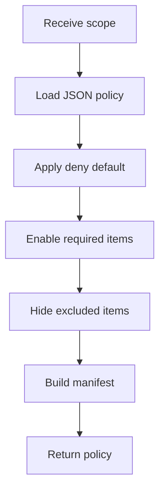

# featureTogglePolicyService.js

- Source: `Backend/src/services/featureTogglePolicyService.js`
- Kind: JavaScript service

## Story
### What Happens Here

This service converts the project-learning scope into model-backed publish toggles with implicit deny. It parses `src/config/projectLearningTogglePolicy.json`, validates that the config covers the full pattern catalog, and then decides which pattern modules, topic sections, and assessment gates should be visible for the current project.

Everything starts off disabled. Only the AI-approved scope becomes enabled.

### Why It Matters In The Flow

The system should not expose irrelevant learning material. The toggle policy makes the study environment project-specific and keeps the rest of the catalog hidden.

### What To Watch While Reading

This service is policy, not content:
- it does not teach the pattern.
- it does not score the intern.
- it only decides what can be reached.
- it operates on the repo-owned toggle policy JSON instead of local hardcoded arrays.
- the JSON config carries aliases and module hints, while project scopes still carry the actual per-project decisions.
- it now covers the full supported pattern set, including `template-method`, repository, and other non-original prompt candidates.

## Service Flow



## Config Contract

Read `docs/Codebase/Backend/src/config/projectLearningTogglePolicy.json.md` first when changing available toggles. The service validates:
- schema version.
- `pattern.*` and `topic.*` key prefixes.
- pattern coverage against `PATTERN_CATALOG`.
- string-array aliases and module hints.

## Input Contract

```json
{
  "projectId": "proj-1024",
  "scopeVersion": "scope-7",
  "requiredPatterns": ["adapter", "facade", "observer", "command", "strategy"],
  "requiredModules": ["structural-adapter", "structural-facade", "behavioural-observer"],
  "requiredTopics": ["module boundaries", "dependency direction", "live updates"],
  "excludedPatterns": ["builder"]
}
```

## Output Contract

```json
{
  "projectId": "proj-1024",
  "scopeVersion": "scope-7",
  "toggles": [
    { "key": "pattern.adapter", "enabled": true },
    { "key": "pattern.facade", "enabled": true },
    { "key": "pattern.builder", "enabled": false }
  ],
  "implicitDeny": true,
  "status": "applied"
}
```

## Acceptance Checks

- The manifest defaults to denied for every unlisted module.
- Only the scoped patterns and topics are enabled.
- Excluded modules remain disabled even if they appear in the broader catalog.
- The policy can be re-evaluated when the scope version changes.
- Toggle candidates are loaded from `projectLearningTogglePolicy.json`.
- The JSON config covers every `PATTERN_CATALOG` slug.
- Pattern keys now cover the broader supported catalog, not just the initial partial set.
