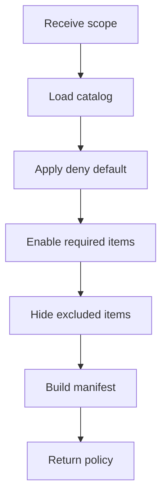

# featureTogglePolicyService.js

- Source: `Backend/src/services/featureTogglePolicyService.js`
- Kind: JavaScript service

## Story
### What Happens Here

This service converts the project-learning scope into model-backed publish toggles with implicit deny. It decides which pattern modules, topic sections, and assessment gates should be visible for the current project.

Everything starts off disabled. Only the AI-approved scope becomes enabled.

### Why It Matters In The Flow

The system should not expose irrelevant learning material. The toggle policy makes the study environment project-specific and keeps the rest of the catalog hidden.

### What To Watch While Reading

This service is policy, not content:
- it does not teach the pattern.
- it does not score the intern.
- it only decides what can be reached.
- it operates on the module model/catalog entries rather than a generic config blob.
- general config is reserved for adding structural pattern families outside the GoF catalog.

## Service Flow



## Input Contract

```json
{
  "projectId": "proj-1024",
  "scopeVersion": "scope-7",
  "requiredModules": ["adapter", "facade"],
  "requiredTopics": ["module-boundaries", "dependency-direction"],
  "excludedModules": ["builder"]
}
```

## Output Contract

```json
{
  "projectId": "proj-1024",
  "scopeVersion": "scope-7",
  "toggles": [
    { "key": "module.adapter", "enabled": true },
    { "key": "module.facade", "enabled": true },
    { "key": "module.builder", "enabled": false }
  ],
  "implicitDeny": true,
  "status": "applied"
}
```

## Acceptance Checks

- The manifest defaults to denied for every unlisted module.
- Only the scoped patterns and topics are enabled.
- Excluded modules remain disabled even if they appear in the broader catalog.
- The policy can be re-evaluated when the scope version changes.
- Module publish state is resolved from the learning model catalog.
- Config is only used when the org wants to add structural pattern families outside the GoF set.
