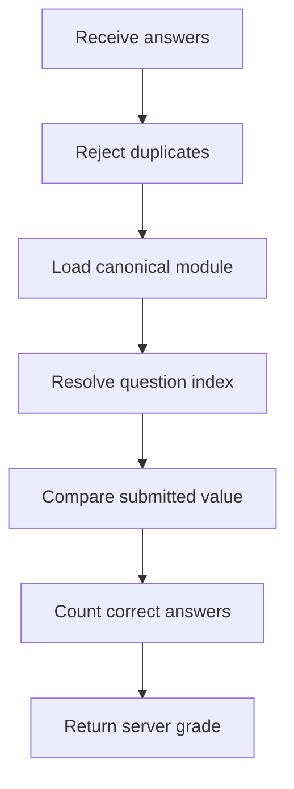
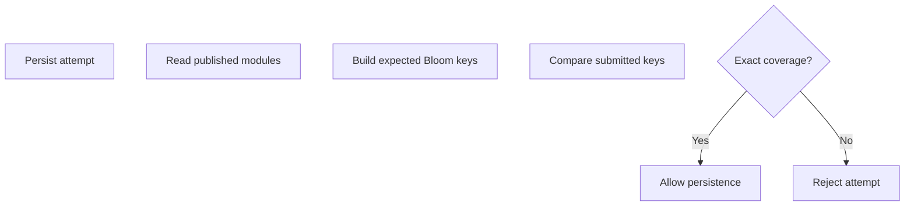

# `learningAssessmentGrader.ts`

## Sole job

Authoritatively grade Learner Path assessments against the canonical questions stored in `learning_modules`. The service ignores client-supplied taxonomy and correctness, rejects duplicate or unknown question references, and treats unanswered values as incorrect.

## Grading flow

## Complete-attempt guard

## Rules

- MCQ answers compare `selectedIndex` with the stored `correctIndex`.
- Identification answers compare normalized tokens with stored `expectedTokens`.
- Studio completion uses the submitted analyzer-success response.
- `selectedIndex = -1` with no response is an unanswered, incorrect item.
- Final pre-tests must contain every published module and all six Bloom buckets.
- The client never supplies an authoritative score or `isCorrect` value.

## Acceptance checks

- All-correct answers produce 100%.
- All-wrong answers produce 0%.
- Mixed answers produce a non-perfect proportional score.
- Unanswered items remain in the denominator and score as incorrect.
- Missing or duplicated question references cannot inflate a saved score.
