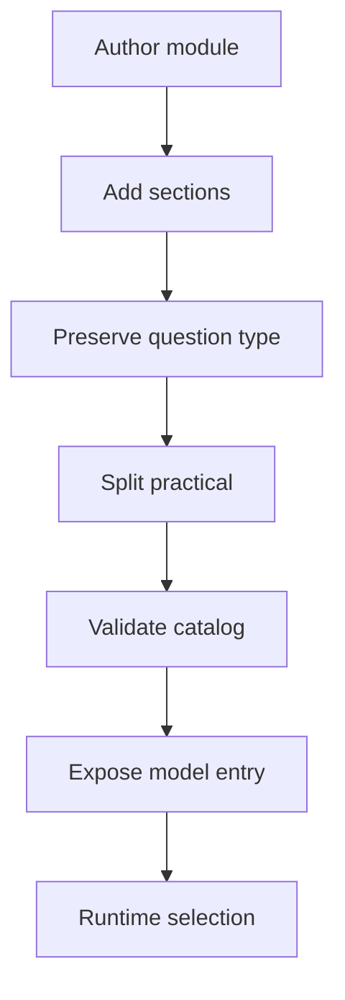

# learningModuleCatalog.ts

- Source: `Backend/src/services/learningModuleCatalog.ts`
- Kind: TypeScript service

## Story
### What Happens Here

This module owns the canonical learning-module catalog for the project-learning system. It is the source of truth for module metadata, section structure, mixed theoretical questions, practical exams, Bloom tags, and publish state.

The important detail is that questions are not converted into one shape at runtime. The instructor-authored module content already carries its question type, tags, and exam split, and the runtime only parses, validates, and selects from that prebuilt structure.

### Why It Matters In The Flow

The course planner and assessment flow both depend on this catalog being stable and explicit:
- course planning decides which model entries are published.
- the course planner now groups AI output by section first, then flattens the enabled modules for compatibility.
- admin planning reads the full catalog, while learner delivery keeps reading the published-only catalog.
- assessments pick from already-tagged questions.
- practical work stays separated from the mixed theoretical question bank.
- future content changes happen by updating the catalog, not by reinterpreting free text.

### What To Watch While Reading

Keep the catalog as content, not policy:
- it defines what exists.
- it does not decide who passes.
- it does not decide project scope.
- it does not generate question tags at the moment of delivery.

## Catalog Flow



## Module Shape

```json
{
  "moduleId": "adapter",
  "title": "Adapter",
  "family": "structural",
  "published": false,
  "sections": [
    {
      "id": "adapter-intent",
      "title": "Intent",
      "topics": ["convert interface", "wrap legacy code"]
    }
  ],
  "theoreticalExam": {
    "kind": "theoretical",
    "questions": [
      {
        "questionId": "adapter-q1",
        "type": "mcq",
        "question": "Which sentence best describes Adapter?",
        "options": ["...", "..."],
        "correctIndex": 1,
        "taxonomy": "remembering"
      },
      {
        "type": "identification",
        "question": "Name the pattern shown by the scenario.",
        "scenario": "A wrapper converts one interface into another.",
        "expectedTokens": ["adapter"],
        "taxonomy": "analyzing"
      },
      {
        "type": "studio",
        "prompt": "Implement a compact Adapter example.",
        "targetPatternSlug": "adapter",
        "starterCode": "// TODO",
        "taxonomy": "creating"
      }
    ]
  },
  "practicalExam": {
    "kind": "practical",
    "enabled": true,
    "saveRawAnswer": true
  }
}
```

## Acceptance Checks

- Every module entry carries its own publish state in the catalog.
- Bloom tags exist on the authored question objects before runtime selection.
- MCQ, identification, and Studio questions survive catalog parsing.
- Theoretical and practical exams remain separate in the catalog.
- The runtime can pick random or filtered questions without inventing new tags.
- The course planner can toggle the model entry without needing a config-level override for GoF modules.
