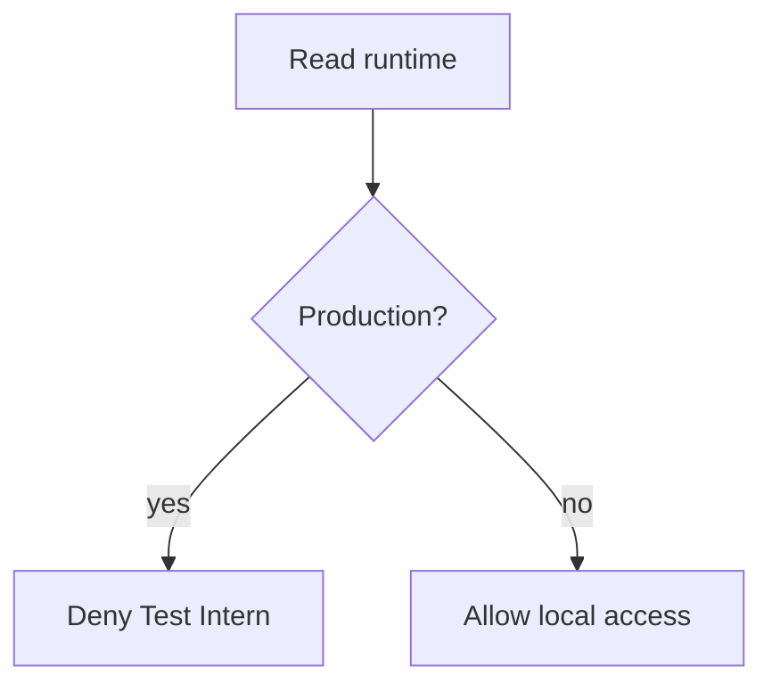

# localDevelopmentAccess.ts

- Source: `Backend/src/services/localDevelopmentAccess.ts`
- Kind: authentication environment policy

## Story

This service owns the production boundary for the local Test Intern login. Development and test runtimes may provision the stable local learner; production may not.

## Acceptance Checks

- Missing, development, and test environments allow local Test Intern access.
- Production disables the endpoint.
