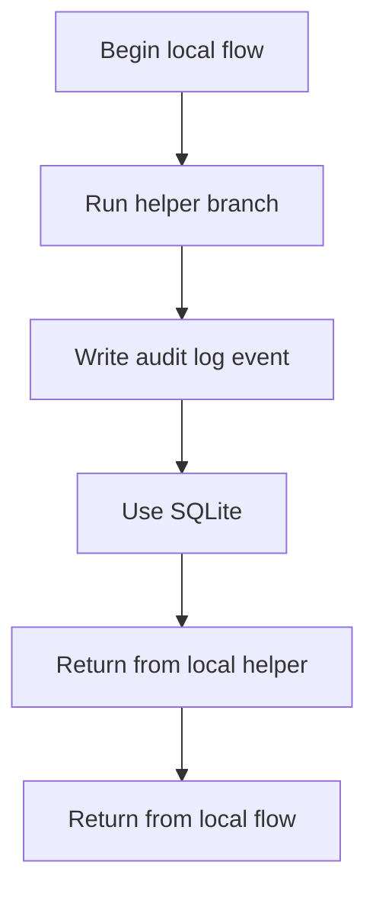
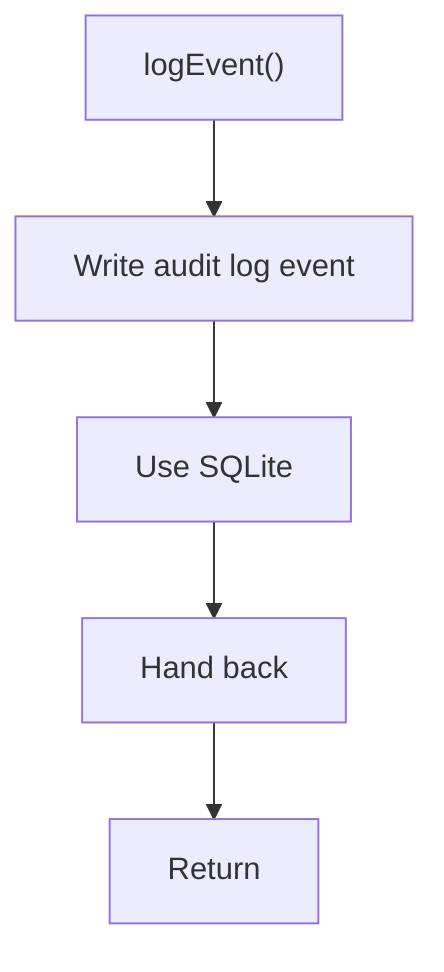

# logService.js

- Source: Backend/src/services/logService.js
- Kind: JavaScript module

## Story
### What Happens Here

This service file implements reusable backend support logic. Its implementation is called from controllers or middleware so those layers can stay focused on request flow.

### Why It Matters In The Flow

This artifact participates in the repository flow according to the surrounding module or toolchain that loads it.

### What To Watch While Reading

Provides backend support services used across request handlers. The main surface area is easiest to track through symbols such as logEvent and db. It collaborates directly with ../db/database.

## Program Flow
This diagram follows the action path in plain words. Decision diamonds show where the file can stop, branch, or repeat work instead of simply passing through a straight line.

## Reading Map
Read this file as: Provides backend support services used across request handlers.

Where it sits in the run: This artifact participates in the repository flow according to the surrounding module or toolchain that loads it.

Names worth recognizing while reading: logEvent and db.

It leans on nearby contracts or tools such as ../db/database.

## Story Groups

### Supporting Steps
These steps support the local behavior of the file.
- logEvent(): Query or update SQLite state

## Function Stories

### logEvent()
This routine owns one focused piece of the file's behavior.

Inside the body, it mainly handles query or update SQLite state.

What it does:
- query or update SQLite state

Flow:

## Documentation Note
- This markdown file is part of the generated docs/Codebase mirror.
- It was generated from the repository state on 2026-04-23 after reading the existing docs corpus and the current source tree.

