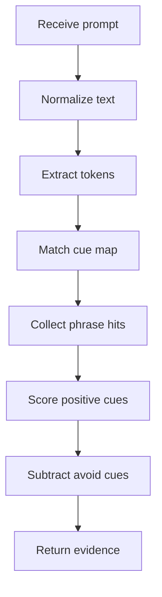

# patternEvidenceService.ts

- Source: `Backend/src/services/patternEvidenceService.ts`
- Kind: TypeScript shared service

## Story
### What Happens Here

This helper service owns the shared pattern-evidence vocabulary and scoring utilities used by the course planner and project intake flow. It centralizes text normalization, token extraction, cue lookup, phrase-hit collection, positive scoring, avoid scoring, and the shared evidence scorer so both callers read the same business language.

The planner now leans on this shared scorer for stricter structural decisions. In particular, Adapter selection depends on explicit translation or compatibility evidence rather than a vague interface mismatch, and the planner can compare that evidence against nearby structural families before it accepts the AI result.

### Why It Matters In The Flow

The planner and intake stages should not drift apart on cue words or scoring rules. If both services score against the same helper, a pattern match means the same thing at both boundaries.

## Evidence Flow

## Shared Data

- `PATTERN_EVIDENCE_HINTS` keeps the shared cue vocabulary for each supported pattern.
- `TOPIC_GROUPS` keeps the shared topic-to-module hint groups used by project intake.

## Acceptance Checks

- The cue vocabulary is defined once and reused by the planner and intake service.
- Text normalization and token extraction stay identical across shared callers.
- Phrase hits and pattern evidence scores come from the same helper path.
- Evidence results expose `positiveScore`, `negativeScore`, and `avoidedEvidence` while keeping the existing final `score`.
- Topic group hints remain available for project intake without duplicating the map in that file.
