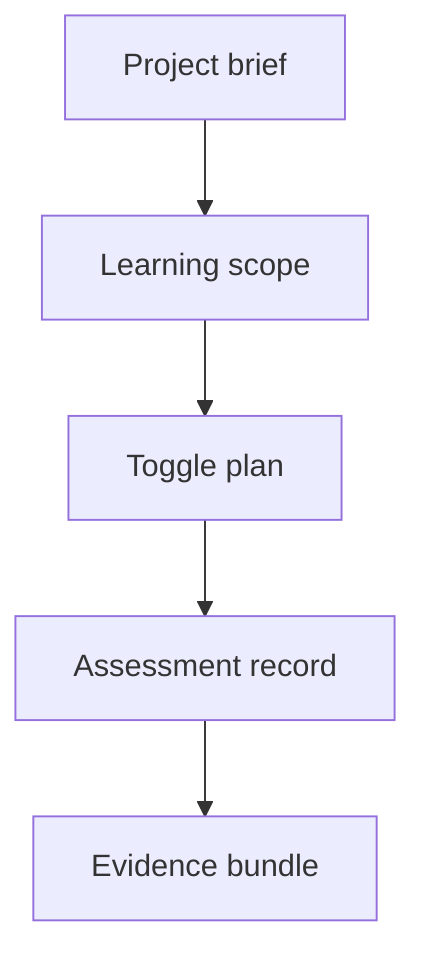

# projectLearningContracts.js

- Source: `Backend/src/services/projectLearningContracts.js`
- Kind: JavaScript contract module

## Story
### What Happens Here

This module owns the shared data shapes for the project-learning workflow. It keeps the route, controller, and service contracts aligned so the project brief, scope plan, toggle plan, assessment attempt, and readiness evidence all mean the same thing everywhere.

### Why It Matters In The Flow

The workflow changes shape across stages:
- project brief in.
- learning scope out.
- toggle manifest out.
- assessment decision out.
- evidence bundle out.

If these shapes drift, the PM review surface and the intern assessment flow stop matching each other.

### What To Watch While Reading

Keep contracts normalized and project-scoped:
- every object should carry `projectId`.
- every assessment record should carry `internId` and `moduleId`.
- every readiness item should be traceable back to the exact evidence bundle.

## Contract Flow



## Core Shapes

### ProjectBriefInput

```json
{
  "projectId": "proj-1024",
  "projectTitle": "Retail billing redesign",
  "businessSpecs": ["..."],
  "architectureSpecs": ["..."],
  "businessProcess": "..."
}
```

### ProjectLearningScope

```json
{
  "projectId": "proj-1024",
  "scopeVersion": "scope-7",
  "requiredPatterns": ["adapter", "facade"],
  "requiredModules": ["module-boundaries", "dependency-direction"],
  "excludedPatterns": ["builder"],
  "notes": ["implicit deny applied"]
}
```

### LearningModuleCatalogEntry

```json
{
  "moduleId": "adapter",
  "title": "Adapter",
  "published": false,
  "family": "structural",
  "source": "model",
  "theoreticalExam": {
    "kind": "theoretical",
    "questions": [
      {
        "questionId": "adapter-q1",
        "question": "Which sentence best describes Adapter?",
        "choices": ["...", "..."],
        "correctIndex": 1,
        "taxonomy": "remembering",
        "topicTags": ["intent", "conversion"]
      }
    ]
  },
  "practicalExam": {
    "kind": "practical",
    "enabled": true
  }
}
```

### ToggleManifest

```json
{
  "projectId": "proj-1024",
  "scopeVersion": "scope-7",
  "toggles": [
    { "key": "module.adapter", "enabled": true },
    { "key": "module.builder", "enabled": false }
  ]
}
```

### AssessmentRecord

```json
{
  "projectId": "proj-1024",
  "internId": "int-44",
  "moduleId": "adapter",
  "attemptType": "pretest",
  "decision": "pass",
  "score": 92,
  "questionTags": ["remembering", "understanding"],
  "practical": false,
  "remarks": "Instructor note only; no open-ended exam item."
}
```

### ReadinessEvidenceBundle

```json
{
  "projectId": "proj-1024",
  "internId": "int-44",
  "summaryStatus": "ready",
  "codeRuns": [],
  "answers": [],
  "rawResults": [],
  "downloads": [
    {
      "type": "xlsx",
      "name": "readiness-audit.xlsx"
    }
  ]
}
```

## Acceptance Checks

- The same project identifier survives every stage of the workflow.
- The toggle manifest can represent both enabled and denied patterns.
- The assessment record can represent pretest and posttest attempts with the same shape.
- The evidence bundle can carry summary results and raw inspection data together.
- The module catalog entry carries pre-authored Bloom tags before runtime assessment starts.
- Practical and theoretical question banks stay separated in the catalog shape.
- The PM bundle can point to spreadsheet exports without losing raw rows.
- Free-text belongs in remarks metadata, not in an open-ended exam question.
